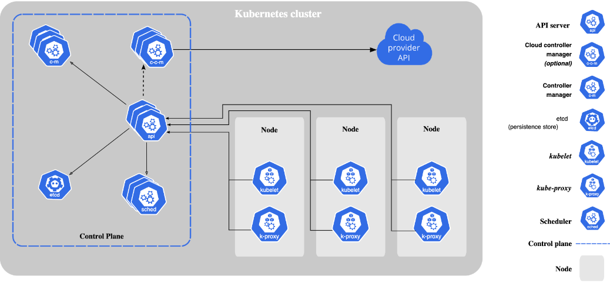
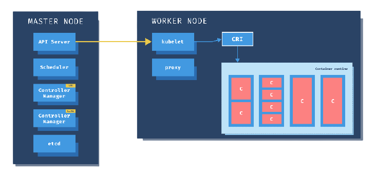
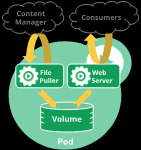
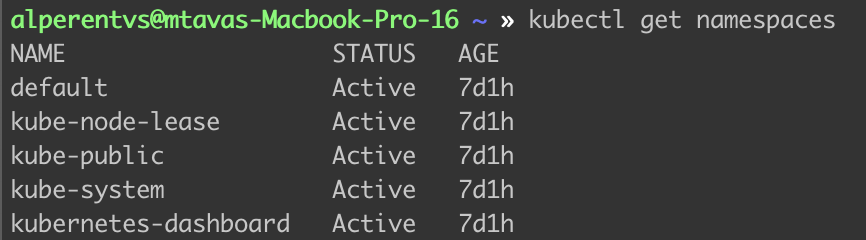
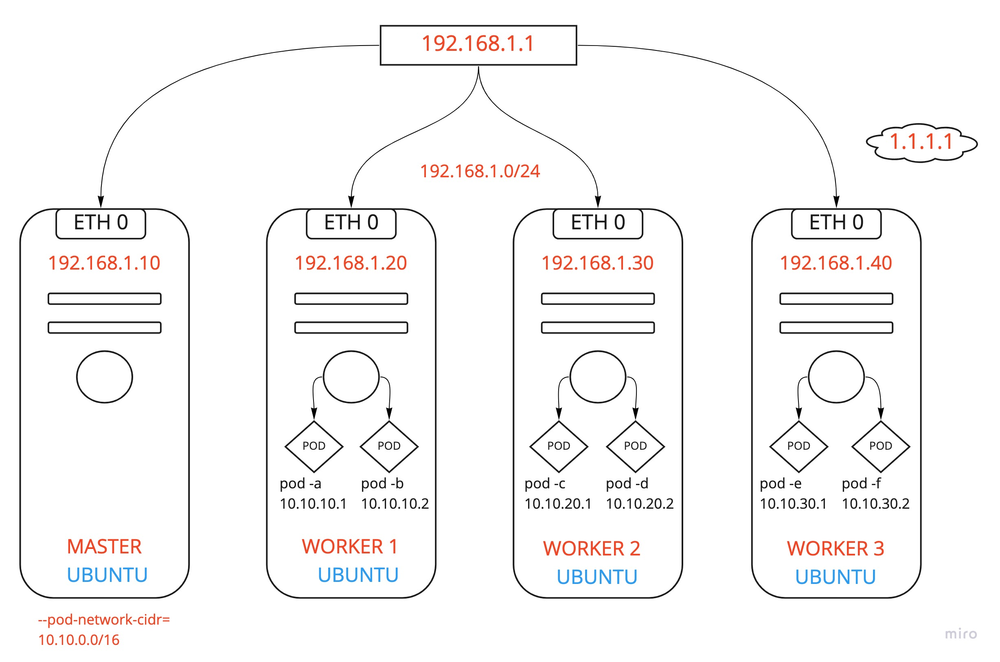
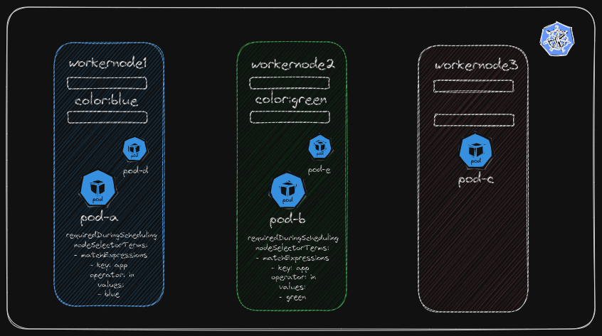

# KUBERNETES

## CONTAINER ORCHESTRATION (Kubernetes Mimarisi)
* Bu kavramı anlamak için hayali bir seneryo kuralım. Diyelim ki bir ekip olarak yeni bir e-ticaret sitesi oluşturuyoruz ve bu uygulamamızı dört ayrı modül olarak tasarladığımızı varsayalım. (Front-end, Back-end, Cache, Veritabanı) Production ortamında containerların gücünden yararlanmak istiyoruz. Bu nedenle tüm bu uygulamaları bir container haline getirdik. Yani e-ticaret uygulamamız bu dört modülden oluşuyor ve biz bunları dört ayrı container olarak çalıştıracağız. Uygulamız hazır, containerlarımız oluşturuldu. Hemen cloud servis sağlayıcılarından birine gittik ve ubuntu yüklü bir sanal makine oluşturduk. Bunun üstüne docker kurduk ve bundan sonra uygulamayı ayağa kaldırmak için yapılması gereken işlemlere başladık. Önce bu uygulamarın birbirleri ile haberleşebilmeleri için bir docker network oluşturduk. Ardından uygulamarı çalıştırabilmek için çeşitli docker komutları girdik, volume'ler oluşturduk, çeşitli ayarlamalar yaptık ve uygulamamız çalışmaya başladı. E-ticaret sitemiz çalışıyor ve bir süre herhangi bir ayarlama yapmadan sitemiz çalışmaya devam etti. Fakat bir süre sonra bu uygulamada bazı sorunlarla karşı karşıya gelmeye başladık. Öncelikle uygulamamız tek bir sunucu üzerinde koşuyor. Bu sistemde en ufak bir değişiklik yapsak sistemde kesintiye neden oluyor. Sistemde güncellemeler, gerekli ayarlamalar yapacak olsak sistemi durdurmamız gerekiyor ve bu da müşterilerin sisteme ulaşamamasına neden oluyor. Doğal olarak bu durum hem işimizi aksatıyor hem de memnuyetsizliğe neden oluyor. Buna bir çözüm olarak ikinci bir sanal makine daha kurduk ve katmanların bir kopyasını oraya yeni oluşturduğumuz sanal makinede de oluşturduk. Bu sanal makinelerin önüne bir Load balancer kurduk ve çeşitli ayarlamalar yaparak bu sistemlerden birisi kapansa bile diğerinden kesinti olmadan çalışması için ayarlamalar yaptık. Bu sorunu bu şekilde çözdük. Ama tek sorunumuz bu değildi. Bu sefer ortamda uygulamamızın koştuğu iki ayrı sistem vardı ve biz birçok işi manuel yapmaya çalışıyorduk. Bazen konteynerlarda bazı sorunlar çıkıyordu ve konteynerlar kendiğiliğinden kapanıyordu. Bunu zar zor izleme sistemleri ile tespit edebilirsek bağlanıp tekrar ayağa kaldırabiliyorduk. Ve bunun gibi gün içerisinde birçok işlem yaparak bu uygulamayı sorunsuz çalıştırmaya çalışıyorduk. Bu sorunu otomatize edebilmek için bir sürü scriptler yazdık, zaman harcadık ama tam olarakta beceremedik. Bunun dışında zaman ilerledikçe daha başka sorunlarda ortaya çıkmaya başladı. Bazı zamanlarda kampanyalar yapıyorduk ve bu dönemlerde yoğun trafik alıyorduk. Fakat sistemlerimiz bu trafiğe cevap verebilecek durumda değildi. Bu nedenle kesintiler yaşamaya başladık. Bu sorunu çözebilmek adına iki yeni sanal makine daha kurduk, sistemleri bunların üzeerinde dağıtmaya başladık, hangi konteynerdan kaç tane oluşturmamız gerekir, bunları ayrı ayrı sanal makinelerda nasıl çalıştıracağız gibi konularda düşünmeye başladık, bir sürü zaman ve emek harcayarak bunları oluşturduk. Fakat gittikçe büyümeye başladığımız için kapasitede zamanla yetmemeye başladı. İki sanal makine daha kurduk, aynı planlamayı bir kere daha yaptık, aynı zahmetli süreçlerden bir kere daha geçtik. Artık elimizde altı ayrı makine üzerinde koşan yirmiden fazla makine var. Bizim bunları ayrı ayrı manuel yönetmemiz için gereken bir sürü parametre var. Hangi uygulama kaç konteyner olarak hangi makineler üzerinde çalışacak, bu konteynerların IP adresleri nelerdir, bu uygulamalar hangi isimle, hangi IP adresi üzerinden haberleşecek gibi birçok bilgiyi exel dosyaları olarak oluşturmamız gerekti. Zamanımızın birçoğunu bunlarla harcamaya başladık derken iş daha da karmaşık bir hal almaya başladı. Uygulama başlangıçta dört model olarak kurgulanmıştı ama zamanla geliştirmeye devam ettik. Orta katmanı mikroservis mimarisine yeniden yazdık. Tek monolik bir uygulamadan altı ayrı module döndürdük. Her modulü ayrı konteyner olarak çalıştırmaya başladık. Bunun yanında bu uygulama ile alakalı ve şirketin başka işleri için kullandığımız bir çok uygulamada bu denkleme girdi ve onları da bu platformda çalıştırmaya başladık. Derken bir sene içerisinde elimizde yirmi tane sanal makine içinde koşan, tamamen manuel olarak yönettiğimiz iki yüzden fazla konteyner oldu. Bu sistemi ayakta tutmak ve yönetmek için sabahtan akşama kadar uğraşıyor ve her şeyi manuel olarak yapıyoruz. Artık sınırımıza geldik. İş nerdeyse kontrolden çıkma durumunda. Zar zor yetişiyoruz. Fakat şirkette büyümeye devam ediyor. Bu hızla devam edersek sistem altı ay sonra üç katı büyüklüğüne çıkacak. İşte o zaman havlu atacağız ve her şey darma duman olacak. Çünkü bizim bu sistemi bu şekilde yönetmeye devam etmeye şansımız yok. 
* Şimdi gelin bir beyin jimnastiği yapalım ve birlikte tüm bu manuel işleri bizim yerimize yapacak bir sistem tasarlayalım. Acaba bu docker yüklü sistemleri adeta bir orkestra şefi gibi yönetecek bir sistem tasarlasak nasıl olurdu? Tüm bu işlemleri manuel olarak sistem üzerinde yapmak yerine bu orkestra şefine: Bak benim uygulamam şu şu kompanentlerden oluşuyor, bu kompanentler şu özelliklerde ve şu sayıda olacak, bu servisler birbirleri ile konuşacak, şunlarda dış dünyadan gelen istekleri karşılayacak diye sistemin olmasını istediğim halini söylesemde o benim adıma tüm bunları ayağa kaldırsa. Hangi konteyner hangi sistemde çalışacak, bunların yük dağılımları nasıl olacak, hangi sistemde yeni konteyner oluşturmak için kapasite mevcut gibi şeylere karar verse. Bunun yanında benim exel dosyalarında tuttuğum IP bilgileri gibi kayıtları kendi üzerinde barındırsa ve daha da ileri gidip sistemi sürekli gözleyerek, yanlış giden durumlarda devreye girip otomatik olarak sistemi benim istediğim konfigürasyonda tutmaya çalışsa; misal bu docker yüklü platformlardan bir tanesinde sıkıntı olduğunda onun üstünde çalışan konteynerları devre dışı bırakarak, o yükleri sorunsuz çalışan diğer sistemler üzerinde dağıtmaya başlasa, sistemdeki problemleri otomatik iyileştirse, kısacası ben tüm orkestrayı ve müzik aletlerini tek tek ayarlamaya çalışmak yerine, orkestra şefine çalışmasını istediğim şarkının notolarını versem de, o şef orkestrayı yöneterek bunun sorunsuz şekilde çalınmasını sağlasa güzel olmaz mıydı? Tabiki de güzel olurdu, güzelde oluyor zaten. Bu güzelliğe **Container Orchestration Sistemleri** diyoruz.
* Genel çatı olarak Container Orchestration Konsepti olarakta bilinen ve az önce açıkladığımız gibi yüzlerce farklı konteynerdan oluşan sistemleri, düzgün şekilde oluşturup yönetmemizi sağlayan bazı araçlar var. Bunların en çok bilinenleri "Docker tarafından oluşturulmuş olan ve Docker engine içerisinde dockerin bir parçası olarak gelen **Swarm**" ve diğeri de "Cloud Native Computing Foundation tarafından açık kaynak bir proje olarak yürütülen **Kubernetes**'tir."

## KUBERNETES NEDİR?
* Kubernetes projesinin resmi sitesinde yazan açıklama şu şekilde: Kubernetes hem beyan temelli yapılandırmayı(declarative configuration) hem de otomasyonu kolaylaştıran, container iş yüklerini ve hizmetlerini yönetmek için oluşturulmuş, taşınabilir ve genişletilebilir açık kaynaklı bir platformdur. 
* Dizayn kısmından bahsedecek olursak; Kubernetes tamamen moduler bir yapıda tasarlanmış ve platform bu şekilde kurgulandırılmıştır. Kubernetes bütün özelliklerin içinde olduğu ve her işi yapan tek bir uygulamadan oluşmuyor. Bunun yerine mümkün olan her koşulda major özellikler ayrı ayrı kompanentlere bölünmüştür. Bu sayede her modül sadece kendi işine odaklanıyor. Bunun geliştirme sürecinin kolaylaştırılmasından, az hata oluşumuna, genişletilebilirlikten esnekliğe sayısız faydası var. Bu alt yapının moduler olmasının yanı sıra kubernetes uygulamanın üstünde koşması gereken modullerinde genişletilebilmesine ve özel çözümler yazılmasına imkan sağlıyor. Bu sayede tüm problemleri tek başına çözmeye çalışmıyor. Ortaya hemen hemen herkesin temel ihtiyaçlarını giderecek sağlam bir alt yapı sunup, bunların dışında kalan özel durumlar içinde bunların giderilebileceği moduller yazılabilmesine engel olmuyor. Yani uzun lafın kısası kubernetesin moduler dizaynı bir çok sıkıntının üstesinden gelebiliyor. 
    - **Declarative Yöntem:** Bu yaklaşımda, ne ihtiyacımız olduğunu tüm detaylarıyla listeleyerek code execution sonrasında elimizde ne olması gerektiğini kullandığımız aracın dilinde kodlayarak belirtiriz. Bunu yaparken ise aracın bu işi nasıl yapabileceğini, kullandığımız araca söylememize gerek yoktur. Bir nevi "Ne gerekli?" sorusunun cevabını veriyoruz.
    - **Imperative Yöntem:** Bazen procedural olarakta bahsedilir. Bu yaklaşımda ise gerekli olan kaynakların nasıl oluşturulacağını kodlayarak belirtmiş oluruz. Burada "Nasıl yapılmalı?" sorusuna cevap veririz. 
* Kubernetes bize **Declarative** bir yöntem sunmaktadır. 

### Kubernetes Komponentleri

* Tek bir kubernetes adında bir uygulama yoktur. Kubernetes platformunu oluşturan bir çok servis mevcuttur ve bu servislerin bir arada düzgün kurgulanarak çalıştırılması sonucu kubernetes platformu oluşturulur. 



* **kube-apiserver:** kube-apiserver, kubernetes API'nın ortaya çıkaran Kubernetes control plane'in en önemli bileşeni ve giriş noktasıdır. Tüm diğer komponent ve node bileşenlerinin direkt iletişim kurabildiği tek komponenttir. Tüm iletişim buradan gerçekleşir. Kube-apiserver, kuberneteste kaynak oluşturma isteklerinin API doğrulamasından sorumludur. Kullanıcılar, kubectl komut satırı istemcisi veya REST-API çağırları aracılığıyla API server ile iletişim kurabilirler. Kısacası kubernetes ile iletişim kurabilmek için API servere erişir, doğrulama işlemlerini tamamlar ve isteklerimizi iletiriz. Aynı şekilde diğer tüm komponentlerde iletişimi **apiserver** ile gerçekleştirir.
* **etcd:** Etcd tüm cluster verisi, metadata bilgileri ve Kubernetes'de oluşturulan tüm objelerin bilgilerinin tutulduğu anahtar-değer "key-value" veri deposudur. Kısacası kubernetesin çalışması için gerekli tüm veriler **etcd** üzerinde tutulur. APIserver hariç diğer hiçbir komponent etcd ile doğrudan haberleşemez. Bu komponentlerin etcd ile iletişim kurması gerektiğinde bunu kube-apiserver aracalığıyla yaparlar. 
* **kube-scheduler:** Kube-scheduler yaratılmak istenen Pod'ların gereksinimlerini kontrol ederek o Pod'un en uygun çalışacağı Workernode'nin hangisi olduğunu tespit eder ve Pod'un burada oluşturulmasını sağlar. (Yeni oluşturulan ya da bir node ataması yapılmamış Pod'ları izler ve üzerinde çalışacakları bir node seçer.) Schuler; Pod'un kaynak isteğini, özel gereksinimlerini(örn: CPU kaynaklarına ihtiyaç duyması gibi) çeşitli parametreleri göz önünde bulundurur ve seçme algoritması sayesinde Pod için en uygun nodenin hangisi olduğuna karar verir. 
* **kube-controller-manager:** Tek bir binary olarak bulunsada içinde birden fazla controller barındırır. Kubernetes mevcut durumu istenilen durumla karşılaştırma temelinde uygulama yönetimi sağlar. Controller-manager altındaki controllerlar kubernetes clusterin mevcut durumuyla ondan istenilen durum arasında fark olup olmadığını gözlerler. Kube-apiserver aracılığıyla etcd de saklanan cluster durumunu izler ve eğer mevcut durum ile istenilen durum arasında fark varsa bu farkı oluşturan kaynakları gerektiği gibi oluşturur, günceller veya silerek bu durumu eşitler. 
* Vermiş olduğum bu dört komponent kubernetesin yönetim kısmını oluşturur. **Control plane** olarak bilinen yönetim kısmı **Master Node** olarak adlandırdığımız sistemler üzerinde çalışır. Tüm bu komponentler tek bir linux yüklü sisteme kurulup ordan erişilebileceği gibi, yüksek erişilebilirlik sağlaması adına birden fazla sisteme de kurulabilir. Üzerinde "Control Plane" komponentlerinin koştuğu sistemlere cluster altında "Master Node" deriz. Master nodeler sadece bu sistemleri barındırmak için bulunur ve özellikle production sistemlerde herhangi bir iş yükümüzü bu sistemler üzerinde çalıştırmayız. Burada sadece clusterin yönetim alt yapısını çalıştırırız. İş yüklerimiz ise **Worker Nodes** üzerinde çalışır. 
* **Worker Nodes:** İş yüklerimizi yani podlarımızı(konteynerlarımızı) üzerinde çalıştırdığımız yerlerdir. Bunlar üzerlerinde containerd veya Docker gibi container runtime barındıran ve clustera dahil edilen sistemlerdir. Her Worker Node'da üç temel komponent bulunur. İlk ve en önemli komponent, konteynerların çalışmasını sağlayacak Container Runtime'dır.



* **Container Runtime:** Container runtime, containerları çalıştırmaktan sorumlu yazılımdır. 
    - Kubernetes birkaç container runtime destekler: Docker, continerd, CRI-O
* **Kubelet:** Her worker node'da bulunur. Kubelet APIserver aracılığıyla etcd yi kontrol eder ve schuler tarafından bulunduğu node üzerinde çalışması gereken bir pod belirtildiyse, Kubelet bu podu o sistemde yaratır. Containerd'ye haber gönderir belirlenen özelliklerde bir konteynerin o sistemde çalışmasını sağlar.
    - Cluster'da ki her node çalışan bir agent'tir. Pod içerisinde tanımlanan containerların çalıştırılmasını sağlar. Kubelet çeşitli mekanizmalar aracılığıyla sağlanan bir dizi Pod tanımı alır ve bu pod tanımında belirtilen containerların çalışır durumda ve sağlıklı olmasını sağlar.
* **Kube-proxy:** Oluşturulan portların TCP, UDP ve SCTP trafik akışlarını yönetir. Ağ kurallarını belirler ve yönetir. Kısacası network-proxy görevi görür.

## KUBERNETES 101
### Kubectl Config
* Kurulumlarımızın ardından kubectl aracının, mevcut bir kubernetes cluster ile iletişim kurabilmesi için nasıl ayarlanacağı ile başlayalım.
* Kubectl aracı bağlanacağı kubernetes cluster bilgisini **config** dosyasından okur. İstenilen bilgileri config dosyasına parametre olarak girerek gerekli tanımlamaları yapabiliriz.
* Kubectl varsayılan olarak /home dizini altında .kube dizini içerisindeki config isimli dosyaya bakar. Dosya mevcutsa değerlere burdan bakar. ($HOME/.kube/config)
* Config dosyasındaki bağlanmak istediğimiz clustera, hangi user ile bağlanacağımızı ve hangi namespaceye erişeceğimizi **contexts** yaratarak belirleriz. 
* Varsayılan config dosyası uzantısını KUBECONFIG enviroment variable değerini değiştirerek güncelleyebiliriz. 

* `kubectl config` --> komutu ile kullanabileceğimiz parametreleri listeleyebiliriz. 
* `kubectl config get-contexts` --> config dosyasındaki mevcut contextleri listeler. Bu komut sonrası çıktıda ki **Current** kısmındaki yıldız işareti olan kısım mevcutta o context'in kullanıldığını ve yapılan değişiklerin o context'te geçerli olacağını simgeler.
* `kubectl config current-context` --> kubectl de tanımlı olan current context'i gösterir.
* `kubectl config use-context "istenilen context"` --> hangi contexte geçmek istediğimizi belirtirken kullanılır. 

### Kubectl Kullanımı
* `kubectl` komutu ile kullanabileceğimiz bütün parametreleri listeleriz.
* `kubectl cluster-info`--> üzerinde işlem yaptığımız cluster ile ilgili temel bilgileri verir.
* kubectl komutunun kullanımı için aklınızda kalacak küçük ama önemli bir tüyo:
    - **kubectl** + yapmak istenilen eylem + eylemi hangi tip objede yapmak istediğin + spesifik bir obje için o objenin ismi
    - **kubectl** + "get,delete,edit,apply" + "pods" + "testpod" 
* Kubectl ile aksini belirtmediğiniz sürece tüm komutlar context'te set edilmiş namespace üzerinde uygulanır. Context'te namespace belirtilmedi ise default isimli namespace üzerinde uygulanır.
    - `kubectl get pods -n kube-system` --> komutu kube-system isimli namespace üzerinde çalışır. 
    - `kubectl get pods -A`--> herhangi bir pods'ta çalışan namespaceleri listeler. Tüm podları kapsar.
* `kubectl get pods -A -o wide` --> output sonucunu daha detaylı bir şekilde verir.
    - **-o** ile kullanılabilecek opsiyonlar:
        * wide
        * yaml
        * json
        * jsonpath
        * go-template
        * custom-columns
* `kubectl explain pod` --> pod komutu hakkında bilgi verir. (man page)

### Kubernetes Objeleri
* Kubernetes üstünde oluşturduğumuz, deploy ettiğimiz, çalıştırdığımız şeylere objeler deriz. 
* Kubernetes üzerinde her şey bir API objesidir ve bizler onun üstünde çalıştırmak istediğimiz iş yüklerini objeler şeklinde oluşturup, ayarlarız. 
* Kubernetes üzerinde oluşturabildiğimiz en temel obje **poddur**
    - cronjob
    - rs
    - pv
    - deploy
    - pod
    - pvc
    - sa
    - job
    - vol

#### POD
* Pod, kuberneteste oluşturup, yönetebileceğimiz en küçük ve temel birimdir. 
* Pod'lar bir ya da daha fazla container barındırabilir. Ama çoğu durumda pod tek container barındırır.
* Her pod'un eşsiz bir id'si (uid) bulunur.
* Her pod eşsiz bir ip adresine sahiptir. 
* Aynı pod içerisindeki containerlar aynı node üstünde çalıştırılır ve bu containerlar birbirleriyle localhost üstünden haberleşebilirler.



* `kubectl run firstpod --image=nginx --restart=Never` --> nginx imagesinden firstpod adında bir pod oluşturduk.
* `kubectl get pods -o wide` --> oluşturduğumuz pode'yi listeledik.
* `kubectl describe pods "objenin ismi"` --> Spesifik bir obje hakkında detaylı bilgi verir. 
    - Describe komutu sadece pods ile çalışmaz. Diğer objeler ile de çalıştırabiliriz.
* `kubectl logs "objenin adı"` --> Objenin log bilgilerini verir.
    - `kubectl logs -f "objenin adı"` --> Logları canlı görebiliriz.
* `kubectl exec "obje ismi" -- hostname` --> pod içine girmeden komut çalıştırabiliriz.
* `kubectl exec -it "obje ismi" -- /bash/sh` --> ile pod'un içindeki konteynera bağlanabiliriz.
* `kubectl delete pods "obje ismi"` --> podu silebiliriz.

### Pods YAML
* Her kubernetes obje tanımında bulunması gereken anahtarlar aşağıdakilerdir:
    - apiVersion:
    - kind:
    - metadata:
    - spec: (hepsinde bulunmayabilir)
* **kind:** oluşturmak istediğimiz objenin ne objesi olduğunu tanımladığımız kısımdır. (pod, servis, deployment)
* **apiVersion:** oluşturmak istediğimiz obje tipinin kubernetesAPI'nda hangi endpoint üstünde tanımlandığını belirttiğimiz kısımdır. (kubectl explain pods kısmındaki VERSION bolumu yazılmalıdır)
* **metadata:** obje ile ilgili bilgileri tanımladığımız kısımdır. Bir dictionarydir. (isim, namespace, label gibi)
* **spec:** her objeye göre değişen kısımdır. Oluşturmak istediğimiz objenin özelliklerini belirtiriz. 
* Aşağıdaki gibi örnek YAML dosyası verilmiştir:
```
apiVersion: v1
kind: Pod
metadata:
  name: firstpod
  labels:
    app: frontend
spec:
  containers:
  - name: nginx
    image: nginx:latest
    ports:
    - containerPort: 80
```
* YAML dosyalarımızı kubernetese declare etmek için **apply** komunutunu kullanıyoruz. Fakat bunun için terminalde YAML dosyamız ile aynı dizince olmamız gerekmektedir.
* `kubectl apply -f "YAML dosyası"` --> oluşturduğumuz YAML dosyasını kubernetese declare eder.
* `kubectl edit pods "obje adı"` --> Herhangi bir kubernetes objesi üstünde doğrudan değişiklik yapmak istediğimizde kullanılır.

### POD Yaşam Döngüsü
* **Pending:** Kubernetes IPserver, oluşturmuş olduğumuz YAML dosyasını alır, burada bizim belirtmiş olduğumuz ayarların yanında varsayılan olarak set edilmiş ayarları işler, koda bir uid ekler ve tüm bu aşamaları etcd'ye kaydeder. Bu noktadan itibaren pod oluşturulmuştur. Pending(ilk aşama)'ya geçer. 
    - Eğer sistemde bir pod'un durumu pending aşamasında ise bu, sistemde yeni bir pod oluşturulduğunu gösterir. Pod ile ilgili bütün ayarlamalar yapıldı ve veritabanını kaydedildi. Ama pod herhangi bir node üstünde oluşturulmadı.
* **Creating:** Schuler, etcd de yeni yaratılmış ve herhangi bir node ataması yapılmamış bir pod görürse çalışmaya başlar. Çalışma mantığına göre podun çalışabileceği en uygun nodeyi gözler ve veritabanındaki pod objesine node bilgisini ekler. Bu aşamadan sonra creating aşaması başlar.
* **ImagePullBackOff:** Her worker node da kubelet adında bir servis çalışır. Kubelette etcd veritabanını gözler ve bulunduğu node atanmış podları tespit eder. Yeni yaratılmış podu görür ve işleme geçer. İlk olarak pod tanımında sistemde oluşturulması istenen konteynerlara bakar ve bu konteynerların oluşturulacağı imageleri sisteme indirmeye başlar. Eğer bir şekilde image indirilemezse pod **imagepullbackoff** aşamasına geçer.
* **Running:** Bu aşamadan sonra kubelet o nodede bulunan konteyner engine ile haberleşir ve ilgili konteynerların oluşturulmasını sağlar. Konteynerlar çalışmaya başladığı anda da node **Running** durumuna geçer.
* Podun içerisinde oluşturulan konteynerlara pod tanımı içerisinde bir **RestartPolicy** tanımı yapılır. RestartPolicy üç değer alabilir:
    - **Always:** Varsayılan değerdir. Podun içerisinde yaratılan konteyner ister hata vererek, isterse hata vermeden, hangi koşulda durdurulursa durdurulsun o konteynerı yeniden başlat demektir. 
    - **On-failure:** Sadece hata alıp kapanırsa yeniden başlatılır.
    - **Never:** Hiçbir durumdu konteyner yeniden başlatılmaz.
* **Succeeded:** Podun altındaki konteynerlar çalışmaya devam ettikçe pod running olarak kalmaya devam eder. Eğer konteynerların hepsi hata vermeden doğal olarak kapanırsa, RestartPolicyde never ya da on-failure olarak set edildiyse  podun statusu **Succeeded** döner ve pod başarılı bir şekilde yaşam döngüsünü tanımlar.
* **Failed:** Yine RestartPolicy never ya da on-failure olarak set edildiği durumda konteynerlardan biri hata verip kapanırsa bu sefer podun statusu **Failed** olarak tanımlanır.
* **CrashLoopBack:** Bir pod oluşturulduğunda, podun içerisindeki konteyner sürekli kapanıp duruyorsa podun statusu **CrashLoopBackOff** durumuna düşer.
    - Kubernetes bu durumda belirli aralıklarla (5 sn - 10 sn - 40 sn) 5 dk oluncaya kadar konteyneri tekrar başlatmaya çalışır. Eğer bu aralıkta konteyner çökmeyi bırakıp çalışmaya başlarsa ve 10 dk boyunca sorunsuz çalışırsa kubelet konteyneri **Running** durumuna döndürür. Aksi durumda siz müdahele edene dek her 5 dk da bir bu işlemi tekrar eder. 

### Multu-Container 
* Bir pod içinde birden fazla konteyner çalıştırmamızı sağlar. Bunun avantajlarını şu şekilde sıralayabiliriz:
    - Aynı pod içinde tanımlanmış bütün konteynerlar, aynı worker-node üstünde oluşturulur.
    - Konteynerlar ayrı birer ünitedir, fakat pod'un life cycle içinde yönetilir. Yani pod oluşturulunca iki konteyner birden oluşturulur, silinirse iki konteyner birden silinir.
    - Bu konteynerlar arasında network izolasyonu bulunmaz. Yani aynı pod içerisinde çalışan A ve B konteynerları birbirlerine localhost üzerinden ulaşabilirler. Bunlar network bakımından sanki aynı makine üzerinde çalışan proseslerdir.
    - Tek bir volume yaratılarak her iki konteynerada mount edilebilir, böylelikle aynı dosyalar üstünde çalışabiliriz. 
* `kubectl exec -it "pod adı" -c "podun içindeki konteyner adı" -- /bin/sh` --> pod içindeki istenilen konteynera bağlanmamızı sağlar. (-c parametresi multi-container için kullanılır ve hangi konteynera bağlanmak istiyorsak onu belirtiriz.)
* `kubectl logs -f "pod adı" -c "podun içindeki konteyner adı"` --> pod içindeki konteynerin loglarına bakabiliriz. 

### Inıt Container
* Inıt containerlar da, Multi Containerlar gibi bir pod içerisinde birden fazla konteyner çalıştırılmasını sağlar. Fakat, multi containerlardan farklı olarak init containerlar podun yaşam döngüsü boyunca çalışmaz. 
    - Uygulama container başlatılmadan önce ilk olarak init container çalışır.
    - Inıt container yapması geren işlemleri tamamlar ve kapanır.
    - Uygulama container, init container kapatıldıktan sonra çalışmaya başlar.
    - Inıt container işlemlerini tamamlamadan uygulama container başlamaz.
* Init konteynerleri, esas uygulamamız çalışmadan önce tamamlamamız gereken şeyler var ve bunları tamamlamadan esas uygulamayı çalıştırmak mantıklı değilse kullanılır. 
* Örn:
```
apiVersion: v1
kind: Pod
metadata:
  name: initcontainerpod
spec:
  containers:
  - name: appcontainer
    image: busybox
    command: ['sh', '-c', 'echo The app is running! && sleep 3600']
  initContainers:
  - name: initcontainer
    image: busybox
    command: ['sh', '-c', "until nslookup myservice; do echo waiting for myservice; sleep 2; done"]
```
#### Özet (Code)
* `kubectl delete -f "dosya_yolu/dosya_ismi"` --> Oluşturulan objeyi dosya kullanarak silme
* `kubectl run "pod_ismi" --image="image_ismi" --port="port_numarası" --labels anahtar:deger_eşlenikleri" --restart=Never` --> Label ve port configürasyonu ekleyerek pod oluşturma
* `kubectl edit "obje_tipi" "obje_ismi"` --> Clusterda bulunan bir kubernetes objesini varsayılan text editörü ile açarak güncelleme
* `kubectl "komut" -w` --> Kubectl komutları sonucu oluşan çıktıyı tek seferlik görmek yerine değişiklikleri izleyebilme imkanına **-w** opsiyonu ile kavuşuruz(watch).
## Label ve Selector
### Label
* Label = Etiket
* Etiketler(tagler) kuberneteste her türlü objeye atayabildiğimiz anahtar değer eşlenikleridir.
* Etiketler sayesinde bizler oluşturduğumuz objelere bizlerin anlayacağı gruplama yaparken kullanabileceğimiz bilgiler eklemiş oluruz. 
    - tier(key"anahtar"):frontend(value"değer")
        * ör: stage:test, name:app1, team:development, ....
### Kubernetes Label
* example.com(prefix"opsiyonel")/tier(anahtar"key"):front-end(değer"value")
* Prefix "önek" kısmı opsiyoneldir. Zorunlu değildir. 
* kubernetes.io/ ve k8s.io/ örnekleri, Kubernetes çekirdek bileşenleri için ayrılmıştır. Bu bileşenler kubernetes tarafından kullanılır.
* Anahtar ve değer alanları 63 karakter veya daha az olmalıdır. (Boşta olabilir)
* Alfanumerik bir karakterle ([a-z, 0-9, A-Z]) başlamalı ve bitmelidir. 
* Tire(-), alt çizgi(_), noktalar(.) ve arasında alfanumerik değer içerebilir.
-----
* Kuberneteste objeler arası bağlantılar etiketler ile kurulur.
-----
### Selector
* Etiket seçme anlamına gelmektedir.
* Label tanımlama
    - **metadata** altında tanımlıyoruz. 
````
apiVersion: v1
kind: Pod
metadata:
  name: pod1
  labels:
    app: firstapp ---> Bu değer isteğe göre düzenlenebilir.
    tier: frontend ---> Bu değer isteğe göre düzenlenebilir.
    mycluster.local/team: team1
spec:
  containers:
  - name: nginx
    image: nginx:latest
    ports:
    - containerPort: 80
````
### Label Listeleme(Pod)
* Labelları kullanarak ortak özelliklere sahip objeleri listeleyebiliriz. 
    - `kubectl get pods -l "app" --show-labels` --> app isimli keyin atanmış olduğu podları listele
    - `kubectl get pods -l "app=firstapp" --show-labels` --> app anahtarına frontend(firstapp) değeri atanmış podları listele
    - `kubectl get pods -l "app=firstapp,tier=frontend" --show-labels` --> app=firstapp ve tier=frontend olanları listele:
    - `kubectl get pods -l "app=firstapp, tier!=frontend" --show-labels` --> app=firstapp ve tier!=frontend olanlar(tier=frontend dışındaki):
    - `kubectl get pods -l "app,tier=frontend" --show-labels` --> app anahtarına sahip ve tier=frontend değeri olanlar
* Yukarıdaki gibi selector kullanımına "equality based selector" yani eşitlik temelli selector kullanımı denir. Fakat tek yöntem bu değildir. Diğer yöntem ise "set based" tir.
* Syntax farklılıkları vardır ama aynı işi yaparlar.
    - Ör: `kubectl get pods -l 'app in (firstapp)' --show-labels`
* Aralarındaki bir diğer fark ise "equality base" eşitlik temelli çalışır. "set base" ise atanmış atanmamış sorgusu yapar.
    - `kubectl get pods -l "app=firstapp, app=secondapp" --show-labels`
    - `kubectl get pods -l "app in (firstapp,secondapp)" --show-labels`
* Buradaki farklılık yukarıdaki(equality) eşitlik ile sorgulama yapacağı ve ',' ve anlamına geleceği için app değeri iki değer alamaz. Ama "set base(aşağıdaki)" app değeri için iki değeride listeler. 
* set yönteminde eşitsizliği "notin" ile ifade ederiz. 
    - `kubectl get pods -l 'app notin (firstapp)' --show-labels` --> Bu komut app=firstapp olmayan tüm podları listeler.
    - `kubectl get pods -l 'app,app notin (firstapp)' --show-labels` --> Bu komut ise app'i sorgula sonra app=firstapp olmayanları listeledir. (burda da ',' ve anlamına gelmektedir)
    - `kubectl get pods -l '!app' --show-labels` --> Bu komut ise içinde 'app' anahtarı bulunmayanları listeler.
* Kubectl ile imperative olarakta label ekleyebiliriz:
    - `kubectl labels pods pod9 app=thiradpp` --> pod9 objesine 'app=thirdapp' labeli ekledik.
* Labeli kaldırmak istersek:
    - `kubectl label pods pod9 app-` --> pod9 objesindeki app isimli labeli kaldırır.
* Label güncellemek için:
    - `kubectl label --overwrite pods pod9 team=team3` --> Label üzerindeki team etiketini günceller.
* Bir namespace üzerindeki bütün podlara label tanımlamak için:
    - `kubectl label pods --all foo=bar` --> Bütün podlara foo=bar labeli tanımlanır.
* Labellar objeler arasında ilişki kurmamızı sağlar demiştik. Yaml dosyam içinde pod tanımı yaparken spec kısmına: 
````
nodeSelector:
  hddtype: ssd
````
* tanımı yaptım diyelim nodeSelectorun avantajı şudur:
* Normal şartlarda kubeschuler kendi algoritmasına göre bir node seçimi yapar. Örneğin beş tane node varsa hangisine karar verdiği algoritma ile olur. Ama biz nodeSelector ile podun çalışmasını istediğimiz nodeyi belirleyebiliyoruz. Bunu da labellar ile yapıyoruz. Yukarıdaki örnekte podun çalıştırılmak istendiği nodeda label olarak hddtype:ssd olsun istenmiş. Bu sayede kubeschuler gidip bu node üzerinde pod oluşturabilir.
* Aynı yaml dosyası üzerinde oluşturulan podlar tek komutla silinebilir. --> `kubectl delete -f "yaml_dosyası"`
## Annotation
* Labellar objeler arasında ilişki kurduğu için hassas bilgi sınıfına girer. Yani label ekleyip çıkartmak kubernetes üzerinde bir şeyleri etkileyebilir. Bu yüzden her türlü bilgiyi label olarak eklemek doğru değildir. Fakat bazı ek bilgileri objeye eklememiz gerekebilir. Örneğin; oluşturulma tarihi ve isim bilgisini vermek istedim. bu bilgiyi label olarak eklemek doğru değildir. Çünkü bu bilgiyi selector kullanarak seçme isteğim yok. bu bilgiyi ilişki içinde oluşturmayacağım. Dolayısıyla bunu label yerine eklemektense annotationa eklemek daha doğru olacaktır. Bunun dışında annotationlar k8s ana kompanenti olmayan fakat k8s ile bağlantısı olan yazılımlar tarafından ihtiyaç duyulacak bilgilerinde yazıldığı yerdir.
* Oluşturulma biçimleri labeller ile benzerdir. Veri kısmı ise labellardan farklı olarak her türlü karakterdeb oluşabilir. 
* Annotationlarda metadata altında tanımlanır. 
````
apiVersion: v1
kind: Pod
metadata:
  name: annotationpod
  annotations:
    owner: "Alperen Tavas"
    notification-email: "alperentavas45@gmail.com"
    releasedate: "01.07.2022"
    nginx.ingress.kubernetes.io/force-ssl-redirect: "true"
spec:
  containers:
  - name: annotationcontainer
    image: nginx
    ports:
    - containerPort: 80
````
* Imperative olarak tanımlayacak olursak:
    - `kubectl annotate pods "pod_ismi" "annotate_bilgisi (foo=bar)"` 
    - `kubectl annotate pods "pod_ismi" "annotate_bilgisi (foo=bar)" -` --> Bilgiyi silmek için
## Namespace
* K8s gerçek cluster üzerinde sanal clusterlarda barındırma özelliğindedir. Kullanılan sanal clusterlerin her birine **Kubernetes Namespace** denir. 
* Namespaceler adlar için bir kapsam sağlar. Kaynak adlarının bir namespace içinde benzersiz olması gerekir. Namespace birbirinin içine yerleştirilemez ve her k8s kaynağı yalnızca bir namespace içinde olabilir.
* Namespaceler cluster kaynaklarını birden çok kullanıcı arasında bölmenin bir yoludur.
* Her k8s kurulumunda varsayılan olarak dört namespace oluşturulur. 
    - `kubectl get namespaces` --> namespaceleri listeler

    

* `kubesystem:` K8s tarafından oluşturulan objelerin tutulduğu namespace
* `kube-public:` Kimliği doğrulanmamış olanlarda dahil tüm kullanıcılar tarafından erişilmesine ihtiyaç duyulan objelerin oluşturulabileceği yerdir.
* `kube-node-lease:` Node-hardware işlemleri için gereken özel namespacedir.
* Kısacası kube ile başlayan namespaceler K8s tarafından oluşturulur ve clusterin işleyişi ile alakalı objelerin tutulduğu yerdir.
* `default:` Bizler aksini belirtmediğimiz sürece objeler burada oluşturulur.
* Tek bir ekip tarafından yönetilen küçük bir clusterimiz varsa herhangi bir namespace tanımı yapmadan başlar ve objelerimizi bir namespace altında toplamayız. Fakat ne zaman büyür ve birden fazla ekip tarafından yönetilen, birden fazka uygulama deploy edildiği bir k8s clustera evrilirsek işte o zaman namespaceler bize kota ayarlaması ve namespace bazında kullanıcı erişimi verme gibi özellikleri sayesinde yardımcı olacaktır. 
### Namespace - Code
* `kubectl get pods --namespace kube-system` --> Kube-system namespacesi altındaki podları listeler.
* `kubectl get pods -A` = `kubectl get pods --all-namespaces` --> Bütün namespacedeki podları listeler. 
* `kubectl create namespace app1` --> app1 adında namespace oluşturur. 
* `kubectl get namespaces` --> Sistemdeki namespaceleri listeler.
* yaml ile bir namespace oluşturmak için(obje tanımlar gibi):
````
apiVersion: v1
kind: Namespace
metadata:                   ---> Development adında namespace oluşturduk
  name: development
---
apiVersion: v1
kind: Pod
metadata:                   ---> Pod tanımında objelerin hangi namespacede konuşlanacağı metadata altında namespace alanında tanımlıyoruz.
  namespace: development         (Belirtmezsen default konuşlanır)
  name: namespacepod
spec:
  containers:
  - name: namespacecontainer
    image: nginx:latest     ---> Burda da container bilgileri var
    ports:
    - containerPort: 80
````
* `kubectl get pods -n development` --> development namespacesi altındaki podları listeler. 
* ! Bizler namespace içerisindeki objelerle iletişim kurarken objenin namespacesinide belirtmemiz gerekiyor. Örn:
    - `kubectl exec -it namespacepod -n development -- /bin/bash` --> Tanımda namespace belirtmeliyiz yoksa default namespacede işlem yapar. 
* **Not:** Peki bizler varsayılan olarak gelen default namespacesini başka namespace ile değiştirebilir miyiz?
    - `kubectl config set-context --current --namespace=development` --> Artık varsayılan namespacemiz development oldu.
    - `kubectl delete namespaces development` --> Development namespacesini siler. (içindeki podlarla birlikte)

## Deployment
* Deployment bir veya birden fazla podu bizim belirlediğimiz desired state göre oluşturan ve sonrasında bu desired stateyi yani istenilen durumu mevcut durumla sürekli karşılaştırıp gerekli düzeltmeleri yapan bir obje tipidir. 
 * Bizler bir deployment objesi oluşturmak için tanım yapar ve bu tanımın içinde oluşturmak istediğimiz podun hangi özelliklerde olması gerektiğini ve kaç adet oluşturmak istediğimizi belirtiriz. Bu deployment objesi oluşturulduğu zaman bu tanımda ve adette pod oluşturulur.
 * Deployment objesi oluşturulduğu zaman tanımlanan ve adette pod oluşturur. Örneğin nginx imagesinden üç tane oluşturan bir deployment oluştururuz. Deployment bunu **desired state** olarak alır ve bu üç pod oluşturur. Sonrasında **deployment controller** devreye girer. Örneğin bu podlardan birisini kubectl ile sildim, Deployment controller bakar, desired state kaç tane pod olması gerekiyor üç, clusterda kaç tane pod var iki, hemen yeni bir pod yaratır ve desired state ile current stateyi eşitler.
 * Bunun dışında deployment objesi bizim kurallar dahilinde pod güncellemeleri yapmamızada imkan sağlar.
 * Özetle bizler k8s üzerinde ne kadar pod oluşturuyor olsakta bu podları direkt pod olarak oluşturmayız. Oluşturmak istediğimiz podları daha üst seviye objeler aracılığıyla oluşturur ve uzun vadede yapmamız gerekecek bir çok işi otomatize etmiş oluruz. Deployment bu objeler içinde en sık kullanılandır ve neredeyse iş yüklerimizin tamamı deployment objesi şeklinde deploy edilir.

 ### Deployment - Code
 * `kubectl create deployment firstdeployment --image=nginx:latest --replicas=2` --> Imperative yöntemle firstdeployment adında deployment objesi yarattık, Replicas ile de iki tane pod oluşturulmasını söyledik. 
 * `kubectl get deployments` --> Deployment objelerini listeler.
 * `kubectl delete pods ...` --> Oluşturulan(deployment ile) podlardan birini silersek deployment objesi otomatik olarak hemen o imageden yeni bir pod yaratır.
 * `kubectl set image deployment/firstdeployment nginx=httpd` --> Bu komut ile önceden oluşturduğumuz(deployment ile) podun imagesini nginxten httpdye taşımak istedik. Bu komut ile deployment objesi bunu gerçekleştirdi. Önce ilk podtaki imageyi değiştirdi ve eskisini kaldırdı, sonra diğer pod için bunu yaptı.
 * `kubectl scale deployment firstdeployment --replicas=4` --> Bu komutla pod sayısını arttırıp azaltabiliriz. 
 * `kubectl delete deployments firstdeployment` --> Firstdeployment objesini siler.

 ### Deployment - yaml
````
apiVersion: apps/v1
kind: Deployment            --> oluşturmak istediğimiz obje
metadata:
  name: firstdeployment     --> deployment objesine isim verdik
  labels:
    team: development       --> deployment objesini tagladık
spec:                       --> deployment objesi ile ilgili özellikleri tanımladık
  replicas: 3               --> kaç tane replica(pod) oluşturulduğu
  selector:
    matchLabels:
      app: frontend
  template:                 --> deployment objesi tarafından oluşturulan podların özellikleri
  ````
 ````
apiVersion: v1
kind: Pod
metadata:                   
  name: examplepod          --> açıklama aşağıda!!
  labels:
    app: frontend
spec:
  containers:
  - name: nginx
    image: nginx:latest
    ports:
    - containerPort: 80
````
* **Açıklama:** Deployment objesini tanımlarken template kısmına, oluşturmak istediğimiz pod bilgilerini yazarız. Bunun kolay yolu pod için hazırlanan yaml dosyasındaki metadata kısmı dahil olacak şekilde template kısmına kopyalayıp yapıştırmaktır. Yapıştırdıktan sonra kopyaladığımız kısmı seçip iki tab boşluk bırakıp boşlukları ayarlarız. Sonrasında metadata kısmında bulunan name kısmı silinir. 
````
apiVersion: apps/v1
kind: Deployment
metadata:
  name: firstdeployment         --> firstdeployment adında deployment objesi 
  labels:
    team: development
spec:
  replicas: 3                   --> template altındaki özelliklerde 3 adet pod yarat
  selector:                     --> deploymentin yöneteceği podlar app:frontend labeline sahip olacak
    matchLabels:
      app: frontend
  template:
    metadata:                   --> yeni yaratılacak podlarada bu labeli ekliyorum ki bu seçme işlemi tamamlansın
      labels:
        app: frontend
    spec:
      containers:
      - name: nginx
        image: nginx:latest
        ports:
        - containerPort: 80
````
* **Not:** Deployment objesi hangi podların kendisine ait, hangisinin onun yönetiminde, hangisi onun yönetiminde değil gibi bilgileri labellar aracılığıyla öğrenir.

## ReplicaSet (rs)
* x sayıda pod oluşturan ve sonrasında mevcut durumla istenilen durum arasında fark oluşursa bunu çözen yani bu işleri halleden obje tipimiz aslında **deployment** değildir. **Replicaset** adında başka bir obje tipi mevcuttur ve bu işlemin tamamını replicaset objeleri halleder. Biz bir deployment oluşturduğumuz zaman bu deployment template altında belirttiğimiz özellikte podları kendi oluşturmaz. Deployment bu özelliklerde bir replicaset objesi oluşturur ve podlar bu replicaset objesi tarafından oluşturulur. 
* Özetle biz bir deployment objesi oluşturduğumuz zaman bu deployment objesi kendi yönettiği bir replicaset objesi oluşturur, bu replicaset objesi podları yaratır ve yönetir. Biz deployment tanımında bir değişiklik yaparsak, örneğin kullanılan imageyi güncellersek, deployment bu tanımla yeni bir replicaset objesi daha yaratır. İlk yaratılan replicaset objesi yavaş yavaş kendi oluşturduğu podları silmeye başlar. Ardından yeni yeni replicaset yeni podları yaratır. Burada bu oluşturma ve silme işleminin hangi sırayla olacağını ve ne şekilde davranacağını bizler belirleyebiliriz. Bu bize herhangi bir kesinti olmadan uygulama güncelleme ve yeni versiyon geçişi yapma imkanı sağlar. 
* Bizler direkt replicaset objesi oluşturmaz onun yerine deploymentin özelliklerinden de yararlanmak için deployment objeleriyle çalışırız.

### Replicaset - Code
* `kubectl get replicaset` --> Replicasetleri listeler
* `kubectl rollout undo deployment firstdeployment` --> firstdeployment isimli deployment objesinde yapılan değişikliği geri alır.
* replicaset ile deployment objesinin yaml dosyalarındaki tek fark replicaset için:
    - `kind: Replicaset` olmasıdır. Diğer her şey aynıdır.
* Biz replicaseti de kendimiz yaratabiliriz ama replicaset, deploymentin bize sunduğu rollout, undo gibi özellikleri sunmadığı için biz replicaseti yaratmak yerine deployment yaratırız, deployment replicaseti yaratır ve biz bu işlemimizi yapabiliriz. 
* Replicaset yaml üzerinde değişiklik yaptığımızda ve bunu uyguladığımızda, replicaset mevcut pod üzerinde işlem yapmaz, yeni oluşturulacak podlar üzerinde bu değişiklikleri yapar.
* `kubectl delete rs firstrs` = `kubectl delete replicaset firstrs` --> firstrs isimli replicaseti siler.

## Rollout ve Rollback
* Deployment özellikleridir. 
* spec altında strategy anahtarıyla bizler bir deploymenti güncellediğimiz zaman **rollout** işlemlerinin nasıl yapılacağını belirleriz. 
* Kullanabileceğimiz iki adet rollout strategysi mevcuttur. 

### 1. Recreate
* Ben bu deploymentte bir değişiklik yaparsam öncelikle tüm mevcut podları sil ve bu işlem tamamlandıktan sonra yeni podları oluştur. Bunu genellikle hardcore migration yaptığımız işlemlerde kullanırız. Yani örneğin uygulamamızın yeni versiyonu ile eski versiyonunun kısa bir süre için bile olsa bir arada çalışmasının sakıncalı olacağı major değişikliklerde **recreate strategy** seçilerek öncelikle tüm eski versiyon sistemnden kaldırılması ve sonrasında yeni podların oluşturulması istenebilir.
````
spec:
  replicas: 3
  selector:
    matchLabels:
      app: recreate
  strategy:
    type: Recreate
````
### 2. RollingUpdate
* Diğer strategy seçeneğimiz **RollingUpdate** dir
* Yaml dosyasında bir strategy belirtmezsek varsayılan olarak **RollingUpdate** seçilir. (Default)
* Recreatingin tam tersidir. Ben bir değişiklik yaptığım zaman tüm podları silip yenisini oluşturma. Bunun yerine bu işi aşamalı olarak yap. Bu aşamalarında nasıl yapılacağını belirleyen iki opsiyon vardır.
    - **maxUnavailable:** Ben bir deploymentte değişiklik yaptığım zaman en fazla burada belirlediğim sayı kadar podu sil. (Sayı yerine % olarakta değer alabilir)
    - **maxSurge:** Bu geçiş sırasında toplam pod sayısının en fazla kaç olabileceğini belirler.
        - Aksini belirtmediğin sürece bu iki değer %25 alınır.
        ````
        spec:
          replicas: 10
          selector:
            matchLabels:
              app: rolling
          strategy:
            type: RollingUpdate
            rollingUpdate:
              maxUnavailable: 2
              maxSurge: 2
        `````
    - **Not:**
        * `kubectl apply -f deployrolling yaml --record`
        * `kubectl edit deployment rolldeployment --record`
        * `kubectl set image deployment rolldeployment nginx=httpd --record`
        * Sondaki record parametresi ile yaptığımız değişiklikleri izleyebiliriz. 
            - `kubectl rollout history deployment rolldeployment` --> Bu komut ile ne zaman, ne değişiklik yaptığımıza bakabiliriz.
            -  `kubectl rollout history deployment rolldeployment --revision=2` --> Bu komut ile sıralanan listeden(bir önceki komut) o sıradaki(2) değişiklikte neler olduğuna bakabiliriz. 
            - `kubectl rollout undo deployment rolldeployment --to-revision=2` --> Listeden 2. sıradaki adıma dönebilirim.
            - `kubectl rollout status deployment deployment rolldeployment -w` --> rolldeployment isimli deployment objesi üzerindeki değişiklikleri canlı izleyebilirim.
            - `kubectl rollout pause deployment rolldeployment` --> Güncellemeyi durdurabilirim.
            - `kubectl rollout resume deployment rolldeployment` --> Güncellemeyi devam ettirebilirim. 

## KUBERNETES AĞ ALTYAPISI
### Kubernetes Ağ Kuralları
* Kubernetes kurulumda podlara IP dağıtılması için bir IP adres aralığı ya da kubernetes terminolojisinde bilinen adıyla `pod-network-cidr` belirlenir. 
* Kubernetesde her pod bu **cidr** bloğundan atanacak bir (unic) IP adresine sahip olur.
* Aynı cluster içerisindeki tüm podlar varsayılan olarak birbirleriyle herhangi bir kısıtlama olmadan ve NAT yani network adress translation olmadan haberleşebilirler.

### Kubernetes Ağ İşleyişi



* 4 tane fiziksel sunucum var ve bunlardan k8s cluster oluşturmak istiyorum. Evdeki internet bağlantımı saylayan bir router var. Bu routerin iç networküde 192.168.1.0/24 networkü. Routerin iç bacağıda 192.168.1.1 ip adresine sahip. Buraya bir switch bağladım ve bu dört makineyi, routeri bu switche bağladım. Makinelerede 192.168.1 networkünden ip adresleri atadım ve hepsinin default gatewayleride routeri görüyor. Bu makineler aynı network üstünde dolayısıylada birbirleriyle habersiz şekilde çalışıyorlar. Default gateway olarakta router ayarlı olduğu için dış dünyaya gidecek olan bütün trafiğide bu routera yönlendiriyorlar ve onun üstünden gitmek istediklere yere gidebiliyorlar. Bu makinelerin hepsine de linux işletim sistemi yükledim. Şimdi sırada k8s kurulumu var. Tüm makinelerde k8s için gerekli ön hazırlıkları yaptım. Master node geçerek k8s kurulumuna başlayacağım. Podlar için bir ip aralığı (pod network cidr) belirlemem gerekti. Bende bu network dışından ip adres aralığı belirledim 10.10.0.0/16 networkünü seçtim. K8s kurulumuna `--pod-network-cidr=10.10.0.0/16` opsiyonunu girerek başladım. Master node ayağa kalktı. Sonra gittim tüm workernodelarıda clustera dahil ettim ve k8s kurulumu tamamlandı. Bu kurulumu tamamladığımızda worker nodeda şu işlemler oldu:
* İlk olarak her worker node üzerinde virtual bridge oluşturulur. Bu virtual bridge bizim başlangıçta belirlediğimiz pod cidr aralığında iletişim kuracak şekilde ayarlanır. Sonrasında yeni bir pod yarattığımız zaman o pod için linux kernelinde ayrı bir network namespace oluşturulur. Bu podun sanal ethernet 0 interfacesine bu pod cidr adres bloğundan bir ip adresi almış durumda. Şimdi network trafiğinin nasıl işlediğini inceleyelim. Bunun için üç ayrı senaryo inceleyeceğiz. Diyelimki diagramdaki **pod a** isimli pod **1.1.1.1** ip adresine sahip dış dünyadaki bir sunucu ile iletişim kurmak istesin. Bu durumda **pod a** iletişim bilgilerini bridgeye teslim edecek, paket burdan worker nodenin eth0 interfacesine ulaşacak, paket burda NAT lanacak, sonrasında worker nodenin default gatewayi olan routera gidecek. Routerda yeniden NAT lanacak ordan da 1.1.1.1 ip adresli sunucuya ulaşacak. Bu sunucudan geri gelen pakette tekrardan NAT lanacak ve pod a ya ulaşacak. Dolayısıyla pod a üstünde çalıştığı worker nodenin ulaşabildiği her destinasyona ulaşabilecek. Bu seneryoda herhangi bir sıkıntı yok. Şimdi geçelim ikinci senaryomuza. İkinci senaryoda yine **pod a** yı ele alalım ve bu sefer **pod a** yı aynı worker nodeda bulunan **pod b** ile iletişim kurmak isteğini varsayalım. 
* Her iki pod aynı worker node üzerinde bulunan bridgeye bağlı ve aynı adres bloğundan ip ye sahipler. Dolayısıyla pod a paketi bridgeye teslim edecek, bridgeden pod b ye gidecek. Pod b de cevabı bridgeye yollayacak ordan da pod a ya dönecek. Aynı networkteki iki makine gibi sorunsuz ve NAT sız birbirleri ile haberleşebilecekler. Bu senaryoda da bir sıkıntı yok. Fakat şimdi üçüncü senaryoyu izleyelim ve çıkabilecek sorunlara bakalım. Bu senaryoda pod a başka bir worker nodeda deploy edilmiş pod ile iletişim kurmak isteyecek. Örneğin worker node 2 üzerindeki pod c ile. Başlangıçta bahsettiğimiz kurala göre podlar pod a, pod c ile nasıl NAT olmadan haberleşecek? Pod a, pod c ye ulaşmak istiyor, paketi bridgeye teslim etti ama bridgede pod c nin ip adresi tanımlı değil. Mecbur trafiği eth0 a gönderecek, eth0 bakacak destination 10.10.20.1 bilmediği bir adres. Kendi ip adres bloğu dışında. Routing tanımlı değil. Mecbur NAT layıp routere teslim edecek, ordada paket kayop olacak. Çünkü routerda paketin nereye gönderileceği ile ilgili bir bilgi yok. Görüldüğü üzere bu senaryoda ayrı worker nodelarda koşan podlar birbirleri ile haberleşemiyorlar. Bu senaryoyu çözebilecek birkaç teknolojiye sahibiz. Misal VxLAN teknolojisini kullanarak bu 10.10.0.0/16 networkunu nodeların bağlı olduğu 192.168.1.0 networku üstünde koşacak bir **overlay network** olarak tanımlayarak NAT'a ihtiyaç duymadan trafik sağlayabiliriz. Ya da podlara 192.168.1.0 networkunden ip verecek şekilde tanımlayıp worker nodenin eth0 larına bu ip adreslerinide tanımlayıp NAT'sız route edebiliriz. Bu vb. bizim network altyapımıza uygun olacak bir çözüm bulabiliriz. Sonuç olarak çözüm var fakat bu çözümleri her network altyapısına uygun olacak şekilde k8s içinde sağlamak neredeyse imkansız. Bunun için bu teknolojilerin ve değişik uygulamarın her senaryoyu kapsayacak şekilde k8s koluna eklenmesi gerekir ve bu da hem zahmetli hemde k8s in yönetmek istediği bir şey değildir. İşte bu nedenle k8s kendi içerisinde bir network çözümü ile gelmez. Bunun yerine şu yöntemleri seçmiştir:
* Konteyner runtimeler ve k8s gibi orkestrayler ortaya çıktıklarında hepsi bu ve benzeri network sorunlarını adreslemek için çeşitli yöntemler denediler ve uyguladılar. Fakat belirli bir zaman sonra bu ayrı ayrı yöntemler karmaşa yarattı. Bu karmaşayı çözmek adına CNCF (Cloud Native Computing Foundation) tarafından tüm bu linux container network alt yapısında ip dağıtımı, bridge tanımları VxLAN tanımlarından ve diğer ayarların standartlarını belirleyecek **Container Network Interface(CNI)** denilen proje başlatıldı. CNI bu konteyner network altyapısının nasıl yapılması gerektiği ile ilgili standartlar yayınladı, developerlerin bu standartlara uygun networking çözümleri oluşturabilmesine imkan sağladı. Bu sayede, bu standartlara uygun şekilde network pluginleri yazılma imkanı doğdu. K8s de bu pod networkini kendim çözmeyeceğim, CNI standartını benimsedim. Siz k8s clusterinizda network çözümünüze uygun şekilde yazılmış ve sizin network çözümünüze uygun olacak bir plugin seçin. Yani özetle: K8s bütün bu işleri kendi üzerinden attı ve sizin k8s i deploy ettiğiniz ortama uygun bir CNI plugini seçerek tüm bu altyapıyı bunun tanımlamasına izin verdi. 
* **CNI:** CNCF projesi olan CNI, linux containerlarda ağ arabirimlerini yapılandırmak için eklentiler yazılabilmesini sağlayan spesifikasyonları belirler. CNI yalnızca containerların ağ bağlantısıyla ve containerlar silindiğinde ayrılan kaynakların kaldırılmasıyla ilgilenir. Bu odak nedeniyle CNI geniş bir desteğe sahiptir ve spesifikasyonun uygulaması kolaydır.
* Bizlerim k8s kurulumunda ortamımıza uygun bir CNI plugini seçmemiz şarttır. Kullanabileceğimiz birçok opensource mevcuttur ve her birinin sunduğu değişik özellikler vardır. 
* Öne çıkan iki tane plugin --> Flannel, Calico
* K8s kurulumunu tamamladıktan sonra bizim kullanacağımız CNI plugini yükleyerek k8s in network yönetimini yüklediğimiz plugine devretmesini sağlayabiliriz. 
  - Örneğin biz bu ortamda calo CNI plugini yüklersek bu noktadan itibaren podların ip adreslerinin atanması, ip table kurallarının düzenlenmesi, nodelar arasında bu podsider bloğunun NAT'sız çalışması için gereken overlay tanımlarının yapılarak VxLAN interfacelerinin oluşturulması dahil tüm görevler calico tarafından hallediliyor. 
### SERVICE
* Bir dizi pod üzerinde çalışan bir uygulamayı ağ hizmeti olarak göstermenin soyut bir yoludur. K8s ile uygulamanın tanıdık olmayan bir hizmet bulma mekanızması kullanacak şekilde değiştirmeniz gerekmez. K8s, podlara kendi IP adreslerini ve bir dizi pod için tek bir DNS adı verir ve bunlar arasında yük dengeleyebilir. 
* Serviceler bir yada daha fazla portun bir yada bir grup poda yönlendirilmesinden sorumlu bileşendir. Açılan servis portlarına sadece cluster içerisinden erişilebileceği gibi aynı zamanda node üzerinden yada Load Balancer üzerinden de erişim sunulabilir. Bu özellikleri sayesinde servisler podların erişim açısından grupladıkları gibi dışarıya açılabilmerini de sağlar.
* Podlarla kıyaslandıklarında oldukça ucuz kaynak olan servislerden k8s clusterinizde istediğiniz kadar oluşturabilmek mümkündür. Podların aksine sabit bir ip adresine sahip olan servisler aksi istenmediği sürece kalıcıdır. 
* Dört tip servis objesi yaratabiliriz: 
* **Cluster IP:** Bir cluster IP objesi yaratıp bunu label selectorler aracılığı ile podlarla ilişkilendirebiliriz. Bu objeyi yarattığımız zaman bu obje cluster içindeki tüm podların ve kaynakların çözebileceği unic bir DNS ismine sahip olur. Bunun yanında bizler her k8s kurulumunda servis cluster IP range anahtarı ile bir sanal ip bloğu belirtiriz. Örneğin 10.100.10.0/16 Biz her cluster ip servis objesi yarattığımız zaman bu objeye bu ip bloğundan bir sanal ip adresi atanır ve ismiyle, bu ip adresi clusterin DNS mekanizmasında kaydedilir. Bu ip adresi virtual bir ip adresidir. Herhangi bir interfaceye map edilmez. Kubeproxy servisi tarafından tüm nodelardaki ip tables eklenir ve buraya oluşan trafik servisin ilişkilendirdiği podlara random bir sıralamayla yönlendirilir. Yani cluster içerisinden bu ip adresine gönderilen paketler bu servisle ilişkilendirilmiş podlardan bir tanesine yönlendirilir. Bu bizim iki sıkıntımızı çözer. Cluster ip servisleri k8s altında basitte olsa service-discovery ve load balancing hizmeti sunan obje tipidir. 
  - Cluster ip türü ile tanımlanan bir k8s servicesi cluster dışından erişilebilir değildir. Cluster ip türü için servise sanal bir cluster ip adresi oluşturularak atanır. Erişimler atanan bu ip adresi üzerinden gerçekleştirilir.
* **NodePort:** Aynen clusterip gibi nodeportta bir servis obje tipidir. Bir nodeport service yaratıp bunu label, selectorlar aracılığıyla podlarla eşleştirebiliriz. Bu obje yaratıldığı zaman şu olur: 30.000 - 32.767 aralığında bir port seçilir ve tüm worker nodelerde bu port bizim servisimize proxylenir. Kısacası worker nodenin ip adresinin bu portuna gelen tüm paketler ilişkilendirdiğiniz podların publish ettiğiniz podlarına yönlendirilir. Sizler de bu worker nodelerin önüne loadbalancer veya reverseproxy koyar ve dış dünyadan erişilmesini sağlarsınız, buraya ulaşacak paketler worker nodelara, worker nodelara ulaşacak paketlerde podların birine ulaşarak kullanıcılarınızın uygulamaya erişmesini sağlarsınız. 
  - Nodeport türü ile tanımlanan bir k8s servicesi cluster dışından da erişilebilir olacaktır. Tanımlama sırasında verilen nodeport değeri ile herbir cluster node'u üzerinde port açılarak servise yönlendirilir. Bu haliyle, aksi belirtilmediği sürece, herhangi bir node üzerinden servise erişilebilir. 
* Yaml:
````
apiVersion: v1
kind: service
metadata:
  name: web-service
spec: 
  type: NodePort
  selector:
    app:frontend
  ports:
    - port: 80
      targetPort: 80
      nodePort: 30006
````
  - Yukarıda sıralanan port, nodePort ve targetPort değerlerinden sadece port değeri zorunludur. Targetport değeri belirtilmemiş ise port ile aynı değere sahip olduğu varsayılmaktadır. Nodeport değeri belirtilmemiş ise varsayılan olarak 30000 - 32767 aralığındaki boş bir değer atanır. 
* K8s 1.5 itibari ile Nodeport olarak tanımlanan servislerde varsayılan olarak Source NAT uygulamaktadır. Yani talebin yapıldığı nodedan farklı bir nodeda yer alan poda yönlendirilen hedef paket içerisindeki istemci IP'si talebin yapıldığı node ip si ile değiştirilmektedir. Bu durumda hedef pod içerisindeki uygulama gerçek istemci IP adresini göremeyecektir.
* **LoadBalancer Service:** Azure k8s service gibi, GKE gibi, cloud servis sağlayılarının manage k8s servislerinde kullanabiliriz. LoadBalancer service tipi obj. oluşturulduğunda cloud servis sağlayıcı dış dünyadan erişilebilecek bir ip adresine sahip bir Loadbalancer oluşturur. Sonrasında bu Loadbalanceri sizin service obj. ilişkendirir. Dolayısıyla bu public ip adresine ulaşan paketler içeriden podlara yönlendirilir. 
  - Loadbalancer türü ile tanımlanan bir k8s service'i aynı NodePort türünde olduğu gibi dışarıdan erişilebilir olacaktır. Nodeporttan farklı olarak Loadbalancer türünde k8s nodelarının önünde önceden konumlanmış yük dengeleyiciler bulunmaktadır. Dışarıdan Loadbalancera gelen trafik arkaplandaki podlara yönlendirilecektir. Loadbalancer türü daha çok bulut tabanlı hizmet sağlayıcılarında görülmekle birlikte MetalLB gibi çözümler sayesinde on-premise sistemlerde de kullanılabilmektedir. 
* **ExternalName:** ExternalName türü ile tanınan, tanımlanan bir k8s service'i önceki türlerde olduğu gibi selector kullanmak yerine DNS adını kullanacaktır. Bu türde, önceki türlerde olan proxy ya da forward işlemleri kullanılmamaktadır. Yönlendirme işlemi DNS seviyesinde gerçekleşmektedir. Konuyu daha iyi anlamak adına örnek verecek olursak: 
* Yaml:
```
apiVersion: v1
kind: service
metadata:
  name: test-service
namespace: prod
spec:
  type: ExternalName
  externalName: abc.com
```
* Pod içine bağlanıp nslookup ile DNS sorgulaması yaparak isim çözümlemenin devrede olduğunu görebiliriz. K8s içerisinde CoreDNS tabanlı bir DNS hizmeti bulunur ve tüm podlar sorguları buraya gönderir. Siz bir servis oluşturduğunuz zaman onun isim ve ip adresi bu DNS te kaydedilir. Dolayısıyla tüm podlar bu isime ait ip adresini öğrenebilirler.
  - DNS ismi = isim.namespace_ismi.svc.cluster_domain
* Aynı namespacede çalışan podlar servisleri kısa isimleri ile çözebilirler. Fakat başka bir namespacede çalışan pod örneğin backend ismini sorgulasaydı bir cevap alamayacaktı, onun yerine tam ismini yazması gerekecekti.
* `kubectl expose deployment backend --type=ClusterIP --name=backend` --> imperative olarak service tanımlarken **expose** komutunu kullanırız. Ardından hangi objeyi expose etmek istediğimizi belirtiriz burada **deployment** olarak tanımladık. Backend isminde olan deploymenti belirttik. 
* Deployment konusunu hatırlarsak, aslında podları deployment objesinin oluşturmadığını, arkada bir replicaset objesi oluşturularak podları bu replicaset objesinin oluşturduğunu biliyoruz. Deployment replicaset yaratır, replicaset'te podları oluşturur. Servis objesinde de buna benzer bir durum vardır. 
* Biz bir service oluşturduğumuz zaman bu service arkada endpoint objesi oluşturur ve bu **endpoint** objesi bizim belirlediğimiz selector tarafından seçilen podların IP adreslerini üstünde barındırır. Servis trafiğini nereye yönlendireceğini bu listeye göre düzenler. 
  - `kubectl get endpoints` --> endpointleri listeler. 
    * Bu komutun çıktısına baktığımız zaman servislerle ilgili aynı isimde endpointler oluşturulmuştur. 
  - `watch kubectl describe endpoints frontend` --> bu komut ile frontend endpointi hakkında detaylara bakabiliriz. 
    * Çıktısına baktığımız zaman Addresses kısmında podlara verilen IP leri görebiliriz. 
--------
## LIVENESS PROBES
* Bir pod oluşturulduğu zaman bu podun koştuğu node üzerindeki kubelet companenti podun containerlarını oluşturur ve bu containerları gözlemeye başlar. Daha doğrusu container engine ile haberleşerek talimat verir ve containerlar oluşturulur. Sonrasında containerlar izlenmeye başlanır. Eğer restart policy On-failure ya da always seçili ise de container içerisinde çalışan uygulama bir şekilde durur ve cevap vermez hale gelirse container restart edilir. Container yeniden başlar, sorun çözülmüş olur. Temel mekanizma bu şekilde çalışıyor. Fakat burada şöyle bir sıkıntı var:
* Bazı durumlarda container içerisinde başlatılan uygulama proses olarak çalışıyor olsa da aslında yapması gereken işlemi yapmıyor olabilir. 
  - Örneğin bir web sayfası yayınlayan podumuz var. httpd temelli bir container çalışıyor. Bu başlayınca container içindeki httpd deamon ayağa kalkıyor ve bizim web sitemizi sunmaya başlıyor. Fakat bir zaman sonra bu servis takılmaya başlıyor. Bir hatadan dolayı sayfaları sunmaya devam edemiyor ama httpd uygulaması yani servis ayakta, servis kapanmadı ya da çökmedi ama esas yapması gereken iş olan web sitemizi sunma işini yapamıyor. Bu ve benzeri durumları yaşadığımız zaman ortamda şöyle bir sıkıntı oluşuyor: Eğer uygulama çalışmıyor olsa yani uygulama kapansa kubelet bunu tespit ederek containeri yeniden oluşturarak sorunu çözüyor. Fakat uygulama ayakta olmasına rağmen yapması gereken işi yapmıyorsa kubelet bunu tespit edemiyor. Dolayısıyla containeri yeniden başlatarak sorunu çözme mekanizması çalışmıyor. Neyse ki bunun **Liveness Probes** adında bir çözümü var. 
* Kubelet, bir containerın ne zaman yeniden başlatılacağını bilmek için liveness probe kullanır. Örneğin, liveness probe, bir uygulamanın çalıştığı ancak ilerleme sağlayamadığı bir kilitlenmeyi yakalayabilir. Böyle bir durumda bir container'ı yeniden başlatmak, hatalara rağmen uygulamayı daha kullanılabilir hale getirmeye yardımcı olabilir. 
* Livenessprobe ile bizler container içerisinde bir komut çalıştırarak ya da bir httpd endpointe request göndererek, bir porta tcp connection açarak uygulamamızın doğru çalışıp çalışmadığını kontrol etme imkanına kavuşuyoruz. Bu sorgulamanın sonunda beklediğimiz sonucu alırsak containerin sağlıklı olduğunu, eğer cevap beklediğimizin dışında çıkarsa da containerda sıkıntı olduğunu tespit edebiliyoruz.  
````
apiVersion: v1
kind: Pod
metadata:
  labels:
    test: liveness
  name: liveness-http
spec:
  containers:
  - name: liveness
    image: k8s.gcr.io/liveness
    args:
    - /server                           --> web deamon, container çalıştığında /server isimli uygulama çalışır
    livenessProbe:                      --> livenessprobe tanımladığımız kısım
      httpGet:                          --> httpdget yöntemini kullanıyorum.
        path: /healthz                  --> localhost/healthz endpointine git (uygulamaya göre değişiklik gösterir)
        port: 8080                      --> 8080 üzerinden bir http GET request gönder, cevap olarak 200 üstü 400 altı(cevap alırsan) cevap dönerse işler yolunda, 400 ve üstü cevap dönerse sıkıntı var
        httpHeaders:                    --> httpget'e özel header eklemek istersek burada tanımlarız
        - name: Custom-Header
          value: Awesome
      initialDelaySeconds: 3            --> container başlatıldıktan sonra uygulama hemen başlamayabilir. Container başlatılsın burada belirtilen süre kadar bekle sonra check et
      periodSeconds: 3                  --> kaç saniyede bir check edilecek
---
apiVersion: v1
kind: Pod
metadata:
  labels:
    test: liveness
  name: liveness-exec
spec:
  containers:
  - name: liveness
    image: k8s.gcr.io/busybox
    args:
    - /bin/sh
    - -c
    - touch /tmp/healthy; sleep 30; rm -rf /tmp/healthy; sleep 600
    livenessProbe:
      exec:                             --> exec ile shell de uygulama ya da komut çalıştırırız. Uygulama 0 code dönerse sağlıklı olduğunu anlarız
        command:
        - cat                           --> cat ile /tmp/healty kontrol ediyoruz
        - /tmp/healthy
      initialDelaySeconds: 5
      periodSeconds: 5
---
apiVersion: v1
kind: Pod
metadata:
  name: goproxy
  labels:
    app: goproxy
spec:
  containers:
  - name: goproxy
    image: k8s.gcr.io/goproxy:0.1
    ports:
    - containerPort: 8080
    livenessProbe:
      tcpSocket:                        --> bazen ne komut çalıştırma ne de http GET istekleri bir şeyin sağlıklı olup olmadığını anlamamıza yaramayabilir. tcpsocket ile porta istek gönderip cevap olarak sonuca varabiliriz
        port: 8080
      initialDelaySeconds: 15
      periodSeconds: 20
````
  - `kubectl describe pod liveness-http` --> pod üzerindeki soruna buradan bakabiliriz.
-------
## READINESS PROBES
* Kubelet, bir containerin ne zaman trafiği kabul etmeye hazır olduğunu bilmek için readiness probeları kullanır. Bir Pod, tüm containerlar hazır olduğunda hazır kabul edilir. Readiness probe sayesinde bir Pod hazır olana kadar service arkasına eklenmez.
* Bir pod terminate edileceği zaman bu sürede pod'a yeni bir trafik gelmemesi için pod service arkasından alınır ve service ile bağlantısı kesilir. Böylece yeni trafik akmaz. Fakat Kubernetes yine de bu pod'u hemen kapatmaz. Çünkü yeni bir trafik gelmese bile bu pod hala eski istekleri işlemeye devam ediyor olabilir. O nedenle bunların bir süre beklenmesi gerekir. Siz ya da kubelet bir podu terminate etmek istediğiniz zaman bu pod'un içinde çalışan PID1 processe sigkill(hemen yaptığın ne varsa bırak ve kapan) komutunu göndermez. Bunun yerine sigterm(process'e yaptığın iş varsa onu düzgünce tamamla ve bitince kapan) dediğimiz sinyali gönderir. Process bu sinyali aldığında eğer ortasında olduğu bir iş varsa onu yapmayı bırakmaz. O işlemleri tamamlar ve bitince tüm bağlantıları düzgünce kapatır ve ardından process'te kapatılır. İşte **terminationGracePeriodSeconds** dediğimiz değer bu container'a düzgün şekilde kendini kapatabilmesi için atadığımız süredir. Eğer process bu süre içerisinde düzgün şekilde kapanırsa sıkıntı olmaz fakat kapanmazsa bu süre sonunda **sigkill** gönderilir ve zorla kapatılır. 
* Pod tanımlarında **terminationGracePeriodSeconds** adında bir key bulunur ve varsayılan değeri 30 sn dir. Aksini belirtmediğiniz sürece bu değer kullanılır. 
* Readiness probe, podun servis sunmaya hazır halde olduğunu belirtir. 
  - Deployment'i güncelledik "v2 imajı"
  - Yeni imajla yeni bir pod(v2) oluşturuldu.
  - Yeni pod(v2) çalışmaya başladı.
  - readiness check mekanizması çalışmaya başladı. initialDelaySeconds kadar bekledi ardından ilk kontrolünü yaptı.
  - Kontrol sonucu olumlu olduğu anda pod(v2) service'e eklendi.
  - Bu noktada eski pod'un (v1) service ile bağlantısı kesildi.
  - Eski pod(v1) henüz kapatılmadı. Eğer işlemesi gereken istekler varsa işlemeye devam ediyor.
  - Eski pod'un(v1) kendini düzgün kapatması için sistem sigterm sinyali yolladı.
  - Pod(v1) üzerindeki işlemleri tamamladıktan sonra kendisi kapattı.
* Liveness ve Readiness Probe birlikte kullanılabilir. 
* Readiness Probe tanımları birebir Liveness Probe tanımları ile aynı syntax'a sahiptir.
```
apiVersion: apps/v1
kind: Deployment
metadata:
  name: frontend
  labels:
    team: development
spec:
  replicas: 3
  selector:
    matchLabels:
      app: frontend
  template:
    metadata:
      labels:
        app: frontend
    spec:
      containers:
      - name: frontend
        image: ozgurozturknet/k8s:blue
        ports:
        - containerPort: 80
        livenessProbe:
          httpGet:
            path: /healthcheck
            port: 80
          initialDelaySeconds: 5
          periodSeconds: 5
        readinessProbe:
          httpGet:
            path: /ready
            port: 80
          initialDelaySeconds: 20
          periodSeconds: 3
---
apiVersion: v1
kind: Service
metadata:
  name: frontend
spec:
  selector:
    app: frontend
  ports:
    - protocol: TCP
      port: 80
      targetPort: 80
```
-----------
## RESOURCE LIMITS
* Containerlar siz aksini belirtmediğiniz sürece varsayılan olarak üzerinde çalıştığı hostun CPU ve memory kaynaklarına sınırsız şekilde erişebilirler. 
* Eğer bir pod koştuğu hostun üzerindeki tüm kaynakları tüketiyorsa bu diğer podların işlerini düzgün yapamayacakları anlamına gelmektedir. Bu nedenle bizim bu podların içerisinde çalışan containerların ne kadar CPU ve memory kullanacaklarını kısıtlamamız gerekebilir. İşte pod tanımlarımızda kullanabildiğimiz **request ve limit** opsiyonları bize bu imkanı verir.
### CPU
* CPU kaynağı, CPU birimleri olarak ölçülür. Kubernetes'te bir CPU şuna eşdeğerdir:
  * 1 AWS vCPU
  * 1 GCP Core
  * 1 Azure vCore
  * 1 Hyperthread bare-metal
* Kesirli değerlere izin verilir. 0,5 CPU talep eden bir container, 1 CPU talep eden bir containerin yarısı kadar CPU alır. Mili anlamında m son eki kullanabilirsiniz. Örneğin 100m CPU, 100 miliCPU ve 0.1 CPU aynıdır. 1m'den daha ince hassasiyete izin verilmez.
* CPU her zaman mutlak bir miktar olarak talep edilir, asla göreli bir miktar olarak talep edilmez; 0.1, tek çekirdekli, çift çekirdekli veya 48 çekirdekli bir makinede aynı miktarda CPU'dur. 
  - 1 CPU Core kullansın --> cpu: "1" = cpu: "1000" = cpu: "1000m"
  - 1 CPU Core'unun %10'unu kullansın --> cpu: "0.1" = cpu: "100" = cpu: "100m"
### Memory
* Cluster'da mevcut durumda kullanılabilir bellek varsa, bir container belirlenen bellek isteğini aşabilir. Ancak bir container bellek sınırından fazlasını kullanmasına izin verilmez. Bir container, sınırından daha fazla bellek ayırırsa, container sonlandırmak için aday olur. Container, limitinin ötesinde bellek tüketmeye devam ederse, container sonlandırılır. Sonlandırılmış bir container yeniden başlatılabiliyorsa, diğer herhangi bir runtime hatası türünde olduğu gibi kubelet onu yeniden başlatır.  
```
apiVersion: v1
kind: Pod
metadata:
  labels:
    test: requestlimit
  name: requestlimit
spec:
  containers:
  - name: requestlimit
    image: ozgurozturknet/stress
    resources:
      requests:
        memory: "64M"
        cpu: "250m"
      limits:
        memory: "256M"
        cpu: "0.5"
```
* CPU ve memory kısıtlamalarını iki ayrı bölümde tanımlayabiliyoruz. Bunlar **request ve limit** bölümleridir. 
* Requests altında tanımlanan bölümler şu işe yaramaktadır: Kubernetes bu podu oluşturmaya başladığı zaman scheduler bu podun oluşturulacağı bir node seçecek. Bu seçme aşamasında kubernetese, bu pod'u en az(yukarıdaki .yaml dosyası için) 64M memory ve 250m milicpu(çeyrek cpu) core'nin erişilebilir olduğu bir node üzerinde schedule et. 
* Kısacası request kısmı bu pod oluşturulabilmesi için minimum ne kadarlık boş kaynağın olması gerektiğini belirtir. Eğer belirtilen değerlere sahip boşlukta olan bir node yoksa bu pod oluşturulmayacaktır. 
* Limit kısmı ise bu containerin en fazla kullanabileceği sistem kaynağını belirtiyor. 
* Eğer container memory limitine geldiğinde daha fazla memory'nin allocate edilmesi için bir mekanizma olmadığından bu duruma gelindiğinde pod **OOMKilled** yani **Out of Memory Killed** durumuna geçerek restart edilir. CPU için böyle bir durum söz konusu değildir. 
------
## ENVIRONMENT VARIABLES
* Bizler, çalıştırdığımız ortama göre değişebilecek bilgileri container imagelerine hard-core olarak gömmeyiz. Onun yerine uygulamarımızda bunların çalıştırıldığı sistemden okuyacakları şekilde bir değişken olarak tanımlarız. Yani environment variable'den okuyacağı şekilde tanım yaparız. 
```
apiVersion: v1
kind: Pod
metadata:
  name: envpod
  labels:
    app: frontend
spec:
  containers:
  - name: envpod
    image: ozgurozturknet/env:latest
    ports:
    - containerPort: 80
    env:
      - name: USER
        value: "Ozgur"
      - name: database
        value: "testdb.example.com"
```
* Environment variables tanımlarını **env** kısmında yaparız. 
* **NOT:** Kubernetes yaptığımız çalışmaları localimizde test edebilmemiz için port-forward imkanı sağlar bunun için:
* `kubectl port-forward pod/envpod 8080:80` komutunu kullanabiliriz.
  - Deployment, pod, service gibi objeler için bunu kullanabiliriz. --> `kubectl port-forward (obje_tipi/objeadı) (istek yapılacak port):(podun hizmet verdiği port)`
-------

## KUBERNETES 102 
### Volume
* Konteynerler stateness yapı için uygundur. Konteynerlar, konteyner imagesi dediğimiz objelerden oluşturulur. Konteyner içerisinde çalışması istenen uygulama ve bu uygulamanın tüm dependencyleri readonly haline getirilir. Bu pakete konteyner imagesi deriz. Bu paketten bir konteyner yaratılır. Konteyner yaratıldığı zaman bu konteynera ait tüm veriler bu konteynera atanan bir layer de tutulur. Yani konteyner içerisinde oluşturulan her tür dosya, konteynera ait bu ayrı layer da durur ve konteyner ayakta olduğu sürece bu veri erişilebilirdir. Fakat konteyner silinirse bu verilerde silinir. Aynı imageden yeni bir konteyner yarattığım zaman, bu konteynerda; eski yazdığım dosyalar bulunmayacaktır.  
* Şimdi bu durum stateless ya da yazdığı verinin konteyner kapatıldığında silinmesinin sorun olmadığı uygulamalar için sıkıntı değildir. Örneğin gelen paketi işleyen ve sonucu başka bir servise gönderen bir backend uygulaması üstünde bir veri barındırmağı için ve herhangi bir state tutmadığı için sıkıntı çıkarmaz. Konteyner silinip yenisi oluşturulduğunda işlemeye devam eder. 
* Fakat her uygulama yukarıda bahsettiğimiz gibi değildir. 
* Konteynerlarda restart diye bir kavram yoktur. Kubernetes bize bunu restart olarak göstersede aslında olan şey şudur: Kubelet sorun yaşanan konteyneri siler ve yeniden bir konteyner oluşturur. Unutulmaması gereken nokta konteyner silindiğinde içindeki verilerde silinmektedir. Keşke podun içerisinde, tüm konteynerların erişebileceği ve podun yaşam süresi boyunca ayakta kalabilecek bir mekanizmaya sahip olsamda dosyaları buraya yazsam. Kubernetes üzerinde böyle bir yapıya sahibiz ve bu yapıya **Ephemeral(Geçici) Volume** diyoruz. 
* Ephemeral volumeler sayesinde bizler verileri fiziksel olarak konteyner dışında tutma imkanına sahip oluyoruz. Bu sayede de konteyner silindiği zaman yeni oluşturulan konteynerinda bu verilere ulaşabilmesini sağlıyoruz.  
* Kubernetes pod tanımlarında kullanabilmemiz için iki tip Ephemeral Volume oluşturmamıza imkan verilir. Bunlardan ilki **emptyDir** adını verdiğimiz volumelerdir. 
#### emptyDir Volume
* Siz emptyDir tipinde bir volume yaratılması için pod tanımınızda gerekli ayarlamaları yaptığınız zaman, K8s bu podun oluşturulduğu node üzerinde boş bir klasör yaratır. Daha sonra siz bu klasörü konteyner içindeki herhangi bir path'e mount edebilirsiniz. Örneğin /cache klasörüne.
* Bu konteynerin mount ettiğiniz path'e yazdığı her türlü dosya fiziksel olarak node üstünde oluşturulmuş olan bu boş klasöre yazılır. Dolayısıyla konteyner silinse bile bu dosyalar silinmez. Yeni konteyner oluşturulduğu zaman tekrar bu volume konteynerda aynı path'e mount edilir. Bu sayede yeni oluşturulmuş konteynerda bu dosyalara erişmeye devam eder. 
* Fakat şunu da bilmeniz gerekir ki; bu dosyalar podun yaşam süresi sonuna kadar erişilebilir durumdadır. Yani pod silinirse bu volumede silinir. Dikkat edilmesi gereken şey konteyner değil, pod içerisindeki konteyner yeniden silinip oluşturulabilir. Bu durumda dosyalar devam eder. Fakat pod silinirse bu volemede silinir. İşte bu nedenle, bu volumelere **Ephemeral(Geçici) Volume** diyoruz. Bunlar sadece bu şekilde geçici olarak, podun yaşam süresi boyunca, konteynerin yaşam süresinden bağımsız olarak saklamamız gereken geçici dosyaları tutmak için vardır. 
* Özetle emptyDir volume ilk olarak bir Pod bir node'a atandığında oluşturulur ve bu Pod o node'da çalıştığı sürece var olur. Adından da anlaşılacağı gibi, emptyDir birimi başlangıçta boştur. Pod içindeki tüm containerlar, emptyDir volume'deki aynı dosyaları okuyabilir ve yazablir, ancak bu birim her konteynerda aynı veya farklı yollara mount edilebilir. Bir pod herhangi bir nedenle bir node'dan silindiğinde, emptyDir içindeki veriler de kalıcı olarak silinir. 
```
- name: sidecar 
  image: busybox
  command: ["bin/sh"]
  args: ["-c", "sleep 3600"]
  volumeMounts: 
  - name: cache-vol
    mountPath: /tmp/log
volumes:
- name: cache-vol
  emptyDir:{}
```
#### hostPath
* hostPath temelde emptyDir ile mantık olarak aynıdır. Yine siz volume yaratılması için Pod tanımınızda gerekli ayarlamaları yaparsınız. Fakat bu sefer rastgele boş klasör yaratılmasını söylemek yerine, pod'un oluşturulacağı worker node üzerindeki spesifik bir klasörü yada dosyayı belirtirsiniz. 
* Örneğin worker node üzerindeki /tmp/cache adındaki klasörün volume olarak kullanılmasını belirtirsiniz. Daha sonra siz bu klasörü yada dosyayı konteyner içerisindeki herhangi bir path'e mount edebilirsiniz. Aynı şekilde dosyalar buraya yazılır ve konteyner silinsede dosyalar silinmez. Peki bunu ne için kullanırız?
* Bu genellikle podların çalıştığı worker node üzerinde bulunan spesifik folder yada dosyalara erişilmesi gerektiği durumlarda işimize yarar. Misal özel bir pathte konuşlanmış unix soketine konteynerin bağlanması gerekirse burayı hostPath ile mount edebiliriz. 
* Özetle bir hostPath volume, worker node dosya sisteminden Pod'unuza bir dosya veya dizini bağlabilme imkanı verir. Bu, çoğu Pod'un ihtiyaç duyacağı bir şey değildir, ancak bazı uygulamalar için güçlü bir kaçış kapısı sunar. 
```
  volumeMounts:
  - name: directory-vol
    mountPath: /dir1
  - name: dircreate-vol
    mountPath: /cache 
  - name: file-vol
    mountPath: /cache/config.json
volumes: 
- name: directory-vol
  hostPath:
    path: /tmp
    type: Directory
- name: dircreate-vol
  hostPath:
    path: /cache
    type: DirectoryOrCreate
- name: file-vol
  hostPath: 
    path: /cache/config.json
    type: FileOrCreate
```
* Ephemeral Volume'ler aynı pod içerisindeki tüm konteynerlara aynı anda bağlanabilir. Yani aynı pod içerisindeki örneğin iki konteynerin birlikte erişebilecekleri alan oluşturmak içinde kullanılabilir.
* - type: Directory --> Bu folder bu worker node üzerinde zaten var.
  - type: DirectoryOrCreate --> Eğer bu folder varsa bunu kullan yoksa bu folderi oluştur.
  - type: FileOrCreate --> Dosya varsa bunu kullan yoksa bu dosyayı oluştur.
* `kubectl exec -it emptydir -c frontend -- bash` --> emptydir podundaki frontend konteynerine bağlanmak için bu komut kullanılır.
---------------------------------------------------------
### Secret
* Hassas verileri image içinde tutmamız sakıncalı bir durumdur. Bu bilgileri environment veriable olarak pod tanımına ekleyerek bu sorunu gideriyor ve bu tarz değişken ve hassas bilgileri image içinde saklamaktan kaçınabiliyorduk. Fakat bu yöntemde tam anlamıyla ideal bir yöntem değil. Environment veriable olarak pod içerisinde tanımladığımız bu hassas bilgiler yaml dosyalarımızdan erişilebilir haldedir. Bu yaml dosyalarına erişebilen herkes, bu bilgilere de erişebilmektedir. İlk sıkıntımız bu. İkinci sıkıntımız ise bizler bu hassas bilgileri uygulamanın kodundan ayırdık fakat bu sefer uygulamanın tanımına ekledik. Bu verilerin değişmesi gerektiği zaman, örneğin bir parolanın değişmesi gerektiğinde benim bunu tanım üstünde yapmam gerekiyor. Bu da bu yaml dosyalarımın generic olmasını engelliyor. Ayrıca bu hassas bilgilerin yönetimiyle, deploy edilen uygulamanın yönetimi ayrı ekiplerde olabilir. Bu ikisini birleştirdiğim zaman bu ayrımı sağlayamıyorum. Bu sorunları çözmek için yapılacak en mantıkl yöntem şudur: Benim bu hassas bilgileri, uygulama deploy ettiğim tanımlardan ayırmam ve ayrı yönetebilmemdir. **Secret** objesi tam da bu işe yarar.
* Secretlar, pod yada deployment gibi bir kubernetes objesidir. Secretlar, kullanıcı adı, şifreler, tokenlar yada SSH anahtarları gibi hassas bilgileri depolamanıza ve yönetmenize olanak tanır. Bu tarz verileri oluşturduğumuz secret objesinde saklar daha sonra bunları çeşitli yöntemlerle podun içerisine ekleyebiliriz. Bu tarz hassas bilgileri bir secret içerisine saklamak, o verileri pod tanımına veya bir konteyner imagesine eklemekten daha güvenli ve esnektir. 
```
apiVersion: v1
kind: Secret
metadata: 
  name: mysecret
type: Opaque
stringData:
  db_server: db.example.com
  db_username: admin
  db_password: P@ssw0rd!
```
* Oluşturduğunuz secretlar ile atayacağınız podlar aynı namespace içerisinde olmalıdır. 
* 8 değişik type'te secret yaratabiliriz. 
* Basic authentication, TLS gibi çeşit çeşit secret tipleri vardır. **Opaque** yada diğer adıyla **generic** te bu typelerden biri ve default olanıdır. 
* Opaque type'nde bir secret oluşturursanız tüm veri tiplerini hiçbir sıkıntı olmadan saklayabilirsiniz. Yani siz Opaque type'nde bir secret yaratıp içinde TLS sertifikanızı saklayabilirsiniz. Hiçbir sıkıntı çıkmayacaktır, ama TLS tipi bir secret yaratıp TLS sertifikasını ve anahtarını onun içerisinde saklarsanız bu sefer KubernetesAPI bu iki değerinde girilmiş olduğundan emin olacağı bir check işlemi yapar. Tek farkı budur. Genellikle Opaque type kullanılır. Çünkü Opaque type istediğimiz veriyi saklamamıza müsade eder. 
  - `kubectl describe secrets mysecret` --> mysecret isimli secret objesi hakkında detaylı bilgi verir. 
* Imperative olarak secret oluşturmak istersek:
  - `kubectl create secret generic mysecret2 --from-literal=db_server=db.example.com --from-literal=db_username=admin --from-literal=db_password=P@ssw0rd!`
* Imperative olarak secret yaratırken dikkat edilmesi gereken durum, hassas bilgilerin hepsinin shell üzerinden girildiğidir. Shell geçmişine birisi erişirse bu değerleri görecektir. Bu sıkıntıyı gidermek adına şöyle bir yöntem vardır.
* Tanımlamak istediğimiz verileri txt formatında oluşturabiliriz. Örneğin server.txt, password.txt, username.txt olacak şekilde üç tane dosya yaratalım ve dosyaların içerisine de değerlerini yazalım. Sonrasında shell üzerinde:
  - `kubectl create secret generic mysecret3 --from-file=db_server=server.txt --from-file=db_username=username.txt --from-file=db_password=password.txt` --> Bu şekilde dosyalar üzerinden tanımlama yapabiliriz.
  - `kubectl create secret generic mysecret4 --from-file=config.json` --> Bu şekilde anahtarın adını vermeden direkt dosya tanımlarsanız , anahtar bu dosyanın ismi olacak, değeride içeriği olacaktır. 
#### Oluşturulan Secretlar Pod İçerisinden Nasıl Okunur?
* Bunun için iki tane seçeneğimiz var.
* Ya bu değerleri pod'a volume aracılığı ile aktarırız, yada bu değerleri environment veriable olarak geçiririz. 
* Volume için örnek verecek olursak:
```
apiVersion: v1
kind: Pod
metadata:
  name: secretpodvolume
spec:
  containers:
  - name: secretcontainer
    image: ozgurozturknet/k8s:blue
    volumeMounts:
    - name: secret-vol
      mountPath: /secret            --> Konteynere mount ederiz.
  volumes:
  - name: secret-vol
    secret:                         --> Secretten oluşturulur!!
      secretName: mysecret3
```
  - Önce volume yaratılır, name kısmı istediğiniz şekilde yazılabilir. Sonrasında bu volumeyi secretten oluştururuz. Daha sonra bunu konteynerda bir folder'a mount ederiz. Sonrasında uygulamamıza bilgileri bu dosyadan tanımlarız. 
* Diğer bir örneğimiz env anahtarı ile environment veriable tanımlamaktır. 
```
apiVersion: v1
kind: Pod
metadata:
  name: secretpodenv
spec:
  containers:
  - name: secretcontainer
    image: ozgurozturknet/k8s:blue
    env:
      - name: username
        valueFrom:
          secretKeyRef:
            name: mysecret3
            key: db_username
      - name: password
        valueFrom:
          secretKeyRef:
            name: mysecret3
            key: db_password
      - name: server
        valueFrom:
          secretKeyRef:
            name: mysecret3
            key: db_server
```
* Değerleri yaml dosyamın içerisine yazmak yerine secretten okuturuz. Yukarıdaki örnekte username'nin değeri mysecret3 ismindeki secretin db_username değeridir. 
```
apiVersion: v1
kind: Pod
metadata:
  name: secretpodenvall
spec:
  containers:
  - name: secretcontainer
    image: ozgurozturknet/k8s:blue
    envFrom:
    - secretRef:
        name: mysecret3
```
* Yukarıdaki örnekte ise yine environment variable olarak tanımlıyorum ama bu sefer tek tek her değeri tek tek tanımlamak yerine, mysecret3 secret'ine bak onun içindeki tüm değerleri environment varible olarak atıyorum. 
  - `kubectl exec -it secretpodenv -- printenv` --> Bu pod içerisindeki bütün env değerlerini listeler. 
* Bir secret yarattığımız zaman bunlar etcd de base64 encoded olarak tutulur. Yani bu veriler encrypted değildir. Dolayısıyla eğer istemediğimiz biri etcd ye erişirse bu hassas bilgilere de sahip olabilir. Fakat bunun çözümleri vardır. Cloud service sağlayıcıları bu çözümleri otomatik olarak sunar. Kendimizin kurduğu kubernetes clusterlarda ise bunu manuel yapmamız gerekiyor. K8s dokumanından encrypted secret data konusundan daha detaylı bilgiye erişebilirsiniz. 
* Son olarak bir secret oluşturduğumuz zaman varsayılan olarak tüm k8s kullanıcıları diğer objelerde de olduğu gibi secretlarda da erişim hakkına sahiptir. Yani bir kullanıcı pod yaratabiliyorsa, varsayılan olarak secretta yaratabilir ve bunlara erişebilir. Bu ve benzeri durumları engellemenin yöntemlerine **RBAC(Role Based Access Control)** konusunda değineceğim.
--------------------------
### ConfigMap
* ConfigMap objeleri, secret objeleri ile birebir aynı işe yarar. Key-value şeklinde değerleri tutarak bunları podlara env yada volume olarak aktarabiliriz. Oluşturulma adımları da neredeyse birebir aynıdır. Komutta yada yaml dosyalarında secret yazdığımız yerlere **ConfigMap** yazarak oluştururuz. Peki farkları nelerdir?
* Secret kullanıcı adı-şifre gibi yada SSH key, sertifikalar gibi hassas verileri saklamak için kullanılan objelerdir. Bunları oluşturduğumuz zaman bu veriler Base64 olarak saklanır bunun yanında ayar yaparsak etcd üzerinde encrypted durabilir. 
* ConfigMap'te ise veriler Base64 encode edilmez ve encrypt etmemize gerek yoktur. ÇÜnkü bizler config map içerisinde gizli olmayan fakat yine de pod tanımımızdan ayırmamız gerekebilen configurasyon verileri tarzı bilgileri tutarız. Yani eğer uygulama dışında tutmanız gereken değerler şifre, SSH anahtarı gibi gizli bir veriyse **Secret**, değilse **ConfigMap** uygun olacaktır. 
  - `kubectl create configmap myconfigmap --from-literal=background=blue --from-file=a.txt` --> ConfigMap tanımını imperative şekilde oluşturmaya yarar.
  - `kubectl get configmaps` --> ConfigMap'leri listeler. 
  - `kubectl delete configmaps myconfigmap` --> myconfigmap configmap'ini siler.
```
apiVersion: v1
kind: ConfigMap
metadata:
  name: myconfigmap
data:
  db_server: "db.example.com"
  database: "mydatabase"
  site.settings: |              --> Secretten farklı olarak tek anahtar altında birden fazla şekilde girebiliriz.
    color=blue
    padding:25px
---
apiVersion: v1
kind: Pod
metadata:
  name: configmappod
spec:
  containers:
  - name: configmapcontainer
    image: ozgurozturknet/k8s:blue
    env:
      - name: DB_SERVER
        valueFrom:
          configMapKeyRef:
            name: myconfigmap
            key: db_server
      - name: DATABASE
        valueFrom:
          configMapKeyRef:
            name: myconfigmap
            key: database
    volumeMounts:
      - name: config-vol
        mountPath: "/config"
        readOnly: true
  volumes:
    - name: config-vol
      configMap:
        name: myconfigmap
```
* Pod'a aktarma şekilleri secret ile aynıdır.
---------------------
### Node Affinity
* İngilizcede yakınlık, benzeşme anlamlarına gelen **affinity**, bizlerin podlarımızın uygun worker nodelar üzerinde oluşturulması için imkan sunan pod opsiyonlarımızdandır. Node selector ile çok benzerdir. Pod tanımına ekler ve podumuzu scheduler edileceği node üstünde eklediğimiz label'in olmasını bekleriz. Bunun yanında, bunun olmasını şart koşar ya da tercih ettiğimizi belirtiriz. 
* Özetle **Node Affinity** kavramsal olarak nodeSelector'a benzer ve nodelara atanan etiketlere göre podumuzun hangi node üstünde schedule edilmeye uygun olduğunu kısıtlamanıza olanak tanır. 
```
apiVersion: v1
kind: Pod
metadata:
  name: nodeaffinitypod1
spec:
  containers:
  - name: nodeaffinity1
    image: ozgurozturknet/k8s
  affinity:
    nodeAffinity:
      requiredDuringSchedulingIgnoredDuringExecution:
        nodeSelectorTerms:
        - matchExpressions:
          - key: app
            operator: In #In, NotIn, Exists, DoesNotExist
            values:
            - blue
```
* Affinity tanımı affinity anahtarı altında yapılır. Burada kullanabileceğimiz iki seçenek mevcuttur. 
* İlki **requiredDuringSchedulingIgnoredDuringExecution** dir. Diğeri ise **preferredDuringSchedulingIgnoredDuringExecution** dir. 
* **requiredDuringSchedulingIgnoredDuringExecution** --> Bu podu ouştururken mutlaka bu altta yaptığım eşleşmeye uygun bir node bul ve bu podu orada oluştur. Uygun node bulamazsanda pod oluşturulmasın. 
* Yukarıdaki örnekte arka planda dönen şudur. Bu pod tanımını kubernetesAPI server'a gönderirsem şu işlemler gerçekleşecektir:
  - Kubernetes tüm worker nodelarda app=blue şeklinde bir label arayacak. Eğer bu label'in olduğu uygun bir worker node görürse bu podu orada scheduler edecek. Tanım required olduğu içinde eğer bu label'a sahip worker node bulamazsa schedule etmeyecek. Pod pending de bekleyecek. 
  - Kısacası required bizim mutlaka sağlanması gereken eşleşme varsa onu belirttiğimiz anahtardır. 
* Burada **operator** olarak kullanacağımız birkaç seçenek vardır. İşte bu seçenekler nodeSelectorden ayrışmamızı ve daha fazla iş yapabilmemizi sağlar. 
  - Yukarıdaki örnekte app=blue label'ine sahip bir worker nodeda pod oluşturulacaktır. Operator olarak **NotIn** kullanılmış olsaydı; üstünde app=blue tanımlanmamış worker nodeda pod ayağa kaldırılacaktı. Bu durumada **antiAffinity** diyoruz. 
  - Yada operator olarak **exists** girsem ve değeri silseydim de şu olacaktı: Bu podu oluşturmak için üstünde app anahtarı tanımlanmış herhangi bir worker node bul demiş olacaktım. Yani değer önemli değil. Örneğin app olsunda değeri önemli değil. 
  - **DoesNotExist** ise **exists** in tam tersidir. Üstünde app anahtarı olmayan bir worker node bul ve orada çalıştır demektir. 
* Özetle **required** değeri verilmişse, aşşağıdaki tanımlamaya uymayan bir durum olursa pod oluşturulmayacaktır. 
* Diğer bir tanımlamada aşağıda belirtildiği gibi yapılır:
```
apiVersion: v1
kind: Pod
metadata:
  name: nodeaffinitypod2
spec:
  containers:
  - name: nodeaffinity2
    image: ozgurozturknet/k8s
  affinity:
    nodeAffinity:
      preferredDuringSchedulingIgnoredDuringExecution:
      - weight: 1
        preference:
          matchExpressions:
          - key: app
            operator: In
            values:
            - blue
      - weight: 2
        preference:
          matchExpressions:
          - key: app
            operator: In
            values:
            - red
```
* **Prefer** seçeneği şu manaya gelir: Ben burada tanım yapıyorum, buna bak ve bu podu bu tanıma uygun bir node üstünde oluştur. Fakat bu tanıma uygun bir node bulamazsanda pending de bekleme. Başka bir node bul ve orada oluştur. 
  - Prefer tanımında **weight** anahtarı da girilebilir. Bu değer 1 ile 100 arasında seçilebilir. Birden fazla tanım giriliyse onların hangisinin daha öncelikli değerlendireceğine bakıyor. 
  - Yukarıdaki örnekte iki tane weight tanımı girilmiştir. Birincisinin değeri 1, diğerinin değeri 2 dir. 2>1 olduğu için daha önceliklidir. 
  - Ben yukarıdaki tanımlı podu oluşturursam şunlar olacaktır: Scheduler tüm worker nodelara bakacak ve app=blue ve app=red labellarına sahip nodeları listeleyecek. Bunlardan app=red weight'i yüksek olduğu için, eğer bu etikete sahip bir node varsa pod burada oluşturulmaya çalışılacak. Eğer bu worker node üzerinde yer yoksa, app=blue olan worker node seçilecek, eğer bunda da yer yoksa yada bu labellerin olduğu hiçbir worker node bulamazsa da uygulama herhangi bir worker node üstünde pod oluşturulacaktır. 
* Özetle **required** olarak tanımlanmışsa bu şart yerine getirilmelidir. Fakat **preferred** olarak girilmişse bu şartı karşılamayı dener fakat karşılayamasada yinede schedule eder. 
* Son olarak bir tanımlama yapacak olursakta key=app olsun, value si hiç farketmez şeklinde aşağıdaki gibi bir pod tanımı oluşturabiliriz. 
```
apiVersion: v1
kind: Pod
metadata:
  name: nodeaffinitypod3
spec:
  containers:
  - name: nodeaffinity3
    image: ozgurozturknet/k8s
  affinity:
    nodeAffinity:
      requiredDuringSchedulingIgnoredDuringExecution:
        nodeSelectorTerms:
        - matchExpressions:
          - key: app
            operator: Exists #In, NotIn, Exists, DoesNotExist
```
* `kubectl label node minikube app=blue` --> minikube nodesine app=blue key-valuesi ekler.
-----------------------
### Pod Affinity
* **Pod affinity**, podunuzun hangi node üstünde oluşturulmaya uygun olduğunu, nodelardaki etiketlere göre değil, halihazırda node'da çalışmakta olan podlardaki etiketlere göre sınırlamanıza olanak tanır.
* Nasıl ki Node Affinity de bir podun oluşturulacağo nodeyi, o node da bulunan ya da bulunmayan  labellera göre seçebiliyorsak, Pod Affinityde de bunu o node üstünde çalışan pod olup olmadığına göre seçebiliriz. 
* Nodelar üstünde önceden tanımlanmış birçok label mevcuttur. Her kubernetes node'sinde **kubernetes.io/arch, kubernetes.io/hostname, kubernetes.io/os** adında üç tane label bulunur. 
  - **kubernetes.io/arch=amd64** o nedinin x64 yada arm tabanlı bir işlemciye sahip olduğunu belirtir. Bu anahtarın değeri amd64 yada arm olabilir.
  - **kubernetes.io/os=linux** ise işletim sistemini belirtir. Linux veya 
  windows değerlerini alır. 
  - **kubernetes.io/hostname=minikube** anahtarı o nodenin hostname değerini alır. 
* Bunun yanında cloud proveiderların yönetilen k8s hizmetlerindeki nodelarda o nodenin hangi regionda bulunduğu **topology.kubernetes.io/region=northeurope** ve hangi availability zoneda bulunduğu da **topology.kubernetes.io/zone=northeurope-1** ile belirtilir.
* Pod affinity tanımlarıda aynı node affinity tanımları gibi **requiredDuringScheduling** ve **preferredDuringScheduling** olarak hard ve soft gereksinimlere sahip olabilirler. Node affinity tanımlarına oldukça benzerdir. Tek bir fark vardır Pod Affinity tanımlarında **topologyKey** olarak bir değer daha gireriz. 
  - **topologyKey** bölümünde hostname seçersem aynı hostname yani aynı worker node üstünde çalıştırılacaktır. 
  - zone seçilmiş olsaydı bu sefer aynı worker node da olmasına gerek olmayacaktı. 
```
apiVersion: v1
kind: Pod
metadata:
  name: frontendpod
  labels:
    app: frontend
    deployment: test
spec:
  containers:
  - name: nginx
    image: nginx:latest
    ports:
    - containerPort: 80
---
apiVersion: v1
kind: Pod
metadata:
  name: cachepod
spec:
  affinity:
    podAffinity:
      requiredDuringSchedulingIgnoredDuringExecution:
      - labelSelector:
          matchExpressions:
          - key: app
            operator: In
            values:
            - frontend
        topologyKey: kubernetes.io/hostname
      preferredDuringSchedulingIgnoredDuringExecution:
      - weight: 1
        podAffinityTerm:
          labelSelector:
            matchExpressions:
            - key: color
              operator: In
              values:
              - blue
          topologyKey: kubernetes.io/hostname
    podAntiAffinity:
      preferredDuringSchedulingIgnoredDuringExecution:
      - weight: 100
        podAffinityTerm:
          labelSelector:
            matchExpressions:
            - key: deployment
              operator: In
              values:
              - prod
          topologyKey: topology.kubernetes.io/zone
  containers:
  - name: cachecontainer
    image: redis:6-alpine
```
* Pod Affinity'nin, Node Affinityden farkı **AntiAffinity** tanımlarının ayrı yapılmasıdır. 
* Node AntiAffinity'i **NotIn** ile halledebiliyorduk, fakat podAntiAffinity' i özel olarak tanımlamamız gerekiyor. Bunu da **podAntiAffinity** anahtarı ile yapılır. 

### Taint ve Toleration
* Node ve Pod affinity tanımlarında bir podun hangi node üstünde schedule edileceği ile ilgili tanımları gördük. Fakat bu işi pod merkezli halletmek bazı durumlarda yeterli gelmiyor. İşte bu yeterli gelmeyen use-caseleride çözebileceğimiz **Taint ve Toleration** ayarları var. Şimdi bunlara değineceğiz. 

<p align="center">
  
</p>

* İlk olarak sorunumuzu tanımlayalım. 
